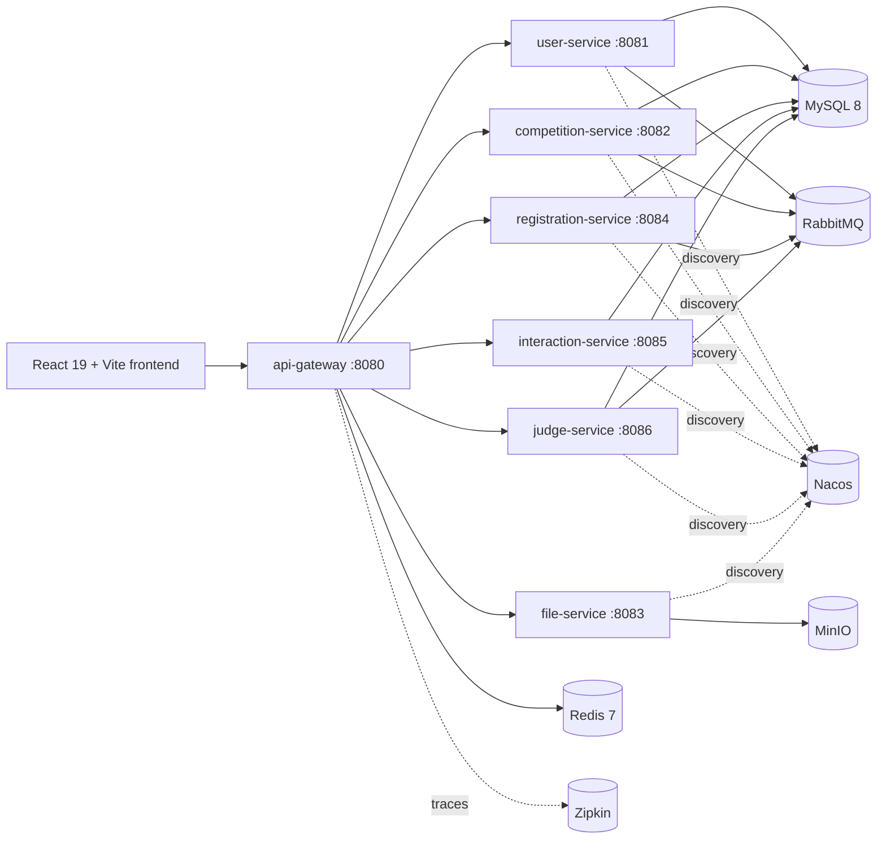

# Questora - Competition Management Platform

Enterprise competition management platform for hackathons, innovation challenges,
academic contests, and internal judging programs. The system combines a
Spring Boot microservices backend with a React/Vite frontend and a Docker Compose
local environment.


## Contents

- [Product Scope](#product-scope)
- [Quick Start](#quick-start)
- [Local Development](#local-development)
- [Architecture](#architecture)
- [Service Matrix](#service-matrix)
- [Frontend Architecture](#frontend-architecture)
- [Backend Contracts](#backend-contracts)
- [Quality Gates](#quality-gates)
- [Project Structure](#project-structure)
- [Configuration](#configuration)
- [Operations](#operations)
- [Documentation](#documentation)
- [License](#license)

## Product Scope

Questora supports the full competition lifecycle:

- Public competition discovery and detail pages.
- JWT login, OAuth login, role-aware navigation, and user profiles.
- Admin, organizer, participant, and judge workflows.
- Competition creation, lifecycle management, media uploads, and visibility.
- Individual and team registrations.
- Submission upload, review assignment, scoring, winner selection, voting, and comments.
- RabbitMQ-backed notification events and SMTP email delivery.

## Quick Start

### Prerequisites

- Docker Desktop with Docker Compose
- Git
- Java 23 for local backend development
- Node.js 20+ for local frontend development

### 1. Configure Environment

```bash
git clone https://github.com/ShousenZHANG/project-contest-platform.git
cd project-contest-platform
cp .env.example .env
```

Fill the required secrets in `.env` before starting the full stack:

```env
MYSQL_ROOT_PASSWORD=root
RABBITMQ_USER=guest
RABBITMQ_PASSWORD=guest
MINIO_ROOT_USER=minio
MINIO_ROOT_PASSWORD=minio123

JWT_SECRET=change_me_256bit_hex_secret

GOOGLE_CLIENT_ID=
GOOGLE_CLIENT_SECRET=
GITHUB_CLIENT_ID=
GITHUB_CLIENT_SECRET=

MAIL_USERNAME=
MAIL_PASSWORD=
```

OAuth and SMTP values are only needed when exercising those flows, but
`JWT_SECRET` must be present for the gateway and user-service. Keep the local
MySQL, RabbitMQ, and MinIO values above unless you also update the matching
backend service configuration.

### 2. Start the Stack

```bash
docker-compose up --build -d
```

First startup can take several minutes because Docker builds the backend service
images and initializes MySQL, Nacos, RabbitMQ, MinIO, and Jenkins volumes.

### 3. Open the Application

| Target | URL | Notes |
| --- | --- | --- |
| Frontend | http://localhost:3000 | React app served by the frontend container |
| API gateway | http://localhost:8080 | Gateway entrypoint for all API calls |
| API docs | http://localhost:8080/doc.html | Knife4j aggregated docs |
| RabbitMQ | http://localhost:15672 | Local default `guest` / `guest` |
| Nacos | http://localhost:8848/nacos | Nacos console |
| MinIO | http://localhost:9001 | Local default `minio` / `minio123` |
| Zipkin | http://localhost:9411 | Distributed tracing UI |
| Jenkins | http://localhost:8888 | Optional CI server |

### 4. Stop the Stack

```bash
docker-compose down
```

To remove local data volumes as well, delete the ignored `.mysql-data/`,
`.redis-data/`, `.rabbitmq-data/`, `.nacos-data/`, and `.minio-data/`
directories after stopping the stack.

## Local Development

### Backend

Windows:

```powershell
.\mvnw.cmd clean install
.\mvnw.cmd test
.\mvnw.cmd test -pl backend/user-service
.\mvnw.cmd test -pl backend/user-service -Dtest=JwtUtilTest
```

macOS/Linux:

```bash
./mvnw clean install
./mvnw test
./mvnw test -pl backend/user-service
./mvnw test -pl backend/user-service -Dtest=JwtUtilTest
```

When running services outside Docker, change infrastructure hostnames in each
`application.yml` from Docker service names such as `mysql`, `redis`, `nacos`,
and `rabbitmq` to local hosts or provide equivalent environment overrides.

### Frontend

```bash
cd frontend
npm install
npm run dev
npm test
npm run build
```

The frontend defaults to `http://localhost:8080` through `VITE_API_BASE_URL`.
During Vite development, `/api/*` is also proxied to the gateway and stripped to
the real backend route.

## Architecture



Requests enter through the gateway. The gateway validates JWTs, applies public
route exemptions, routes to service instances through Nacos, and forwards the
current user identity with `User-ID` and `User-Role` headers.

## Service Matrix

| Module | Runtime port | Gateway routes | Responsibility |
| --- | ---: | --- | --- |
| `backend/api-gateway` | 8080 | All public API entrypoints | JWT validation, routing, CORS, docs aggregation |
| `backend/user-service` | 8081 | `/users/**`, `/teams/**` | Users, roles, OAuth, teams, notification emails |
| `backend/competition-service` | 8082 | `/competitions/**` | Competitions, organizers, judges, lifecycle metadata |
| `backend/file-service` | 8083 | `/files/**` | MinIO upload, download, delete, URL handling |
| `backend/registration-service` | 8084 | `/registrations/**`, `/submissions/**` | Registrations and submissions |
| `backend/interaction-service` | 8085 | `/interactions/**` | Submission votes and comments |
| `backend/judge-service` | 8086 | `/judges/**`, `/winners/**`, `/dashboard/**` | Scoring, reviews, winner selection, dashboard data |
| `backend/coverage-report` | N/A | N/A | JaCoCo aggregated coverage report module |

## Frontend Architecture

The frontend is a React 19 application built with Vite, Tailwind CSS 4,
Radix-based UI primitives, React Router 6, Axios, TanStack Query, Sonner,
Framer Motion, and Recharts.

Key conventions:

- `src/layouts/` owns shared application shells. Pages should not create fixed
  sidebars or fixed topbars locally.
- `src/components/ui/` contains Radix-style primitives and shared design-system
  building blocks.
- `src/shared/components/` contains reusable domain UI such as confirmation
  dialogs, empty states, loading states, and feedback surfaces.
- `src/api/apiClient.js` is the only Axios gateway client.
- `src/auth/authTokenManager.js` is the auth session boundary. Business UI
  should not read or write auth `localStorage` keys directly.
- `src/services/serviceUtils.js` normalizes Axios responses, standard
  `ApiResponse<T>` envelopes, and historical raw payloads.

## Backend Contracts

Backend modules use DTO/VO/PO layering and the service-interface pattern:

- `domain/dto/` for request input.
- `domain/vo/` for response output.
- `domain/po/` for persistence entities.
- `service/I*Service.java` and `service/impl/*ServiceImpl.java` for business logic.
- `feign/` clients for service-to-service calls.
- `config/*RabbitMQConfig.java` for async event topology.

HTTP response policy:

- New JSON endpoints should return `ApiResponse<T>`.
- Controller success messages should use `ApiResponses.message(...)`.
- Errors are handled by each service-level `GlobalExceptionHandler`.
- File-service URL and Feign compatibility endpoints can keep raw string bodies
  where that contract is intentional.

Authentication policy:

- The gateway owns JWT validation.
- Public route exemptions are configured in `jwt.public-urls`.
- Authenticated controllers should receive identity through
  `@CurrentUser RequestContext`.
- Controller tests for authenticated routes should include both `User-ID` and
  `User-Role` headers.

## Quality Gates

Run these before committing changes:

```bash
# Backend
./mvnw test

# Frontend
cd frontend
npm test -- --runInBand --silent --detectOpenHandles
npm run build
```

On Windows, use `.\mvnw.cmd test` instead of `./mvnw test`.

Repository hygiene checks:

```bash
git diff --check
git status --short
git ls-files | Select-String -Pattern '(^|/)\\.DS_Store$|^frontend/(coverage-summary|playwright-report|test-results)/'
```

Generated outputs under `frontend/coverage-summary/`,
`frontend/playwright-report/`, and `frontend/test-results/` must stay untracked.

## Project Structure

```text
project-contest-platform/
|-- backend/
|   |-- api-gateway/
|   |-- common-lib/
|   |-- user-service/
|   |-- competition-service/
|   |-- file-service/
|   |-- registration-service/
|   |-- interaction-service/
|   |-- judge-service/
|   `-- coverage-report/
|-- frontend/
|   |-- src/
|   |   |-- api/
|   |   |-- auth/
|   |   |-- components/
|   |   |-- context/
|   |   |-- layouts/
|   |   |-- routes/
|   |   |-- services/
|   |   |-- shared/
|   |   |-- Admin/
|   |   |-- Organizer/
|   |   |-- Participant/
|   |   |-- PublicUser/
|   |   `-- Homepages/
|   |-- Dockerfile
|   |-- package.json
|   `-- vite.config.js
|-- docs/
|   |-- CODEMAPS/
|   |-- adr/
|   `-- agents/
|-- mysql-init/
|-- docker-compose.yml
|-- pom.xml
|-- AGENTS.md
`-- CLAUDE.md
```

## Configuration

| Variable | Used by | Required | Purpose |
| --- | --- | --- | --- |
| `MYSQL_ROOT_PASSWORD` | MySQL, backend datasource defaults | Yes for Docker | Root database password; local backend config expects `root` |
| `RABBITMQ_USER` | RabbitMQ | Yes for Docker | RabbitMQ user; local backend config expects `guest` |
| `RABBITMQ_PASSWORD` | RabbitMQ | Yes for Docker | RabbitMQ password; local backend config expects `guest` |
| `MINIO_ROOT_USER` | MinIO | Yes for Docker | MinIO user; local file-service config expects `minio` |
| `MINIO_ROOT_PASSWORD` | MinIO | Yes for Docker | MinIO password; local file-service config expects `minio123` |
| `JWT_SECRET` | Gateway, user-service | Yes | JWT signing and validation secret |
| `GOOGLE_CLIENT_ID` | user-service | OAuth only | Google OAuth client ID |
| `GOOGLE_CLIENT_SECRET` | user-service | OAuth only | Google OAuth secret |
| `GITHUB_CLIENT_ID` | user-service | OAuth only | GitHub OAuth client ID |
| `GITHUB_CLIENT_SECRET` | user-service | OAuth only | GitHub OAuth secret |
| `MAIL_USERNAME` | user-service | Email only | SMTP username |
| `MAIL_PASSWORD` | user-service | Email only | SMTP app password |
| `VITE_API_BASE_URL` | frontend | Optional | API gateway base URL, default `http://localhost:8080` |

Never commit `.env`, local database volumes, generated coverage output, or
browser test artifacts.

## Operations

Useful Docker commands:

```bash
docker-compose ps
docker-compose logs -f backend-api-gateway
docker-compose logs -f backend-user-service
docker-compose logs -f frontend-web
docker-compose restart backend-api-gateway
docker-compose down
```

Useful local checks:

```bash
curl http://localhost:8080/actuator/health
curl http://localhost:3000
```

If the frontend loads but API calls fail, verify that:

1. `backend-api-gateway` is healthy.
2. Nacos is healthy and all backend services are registered.
3. `JWT_SECRET` is identical for the gateway and user-service.
4. The frontend `VITE_API_BASE_URL` points at the gateway.

## Documentation

Read these files when changing architecture or agent workflows:

- `AGENTS.md` - repository instructions for Codex agents.
- `CLAUDE.md` - repository instructions for Claude agents.
- `docs/CODEMAPS/architecture.md` - system architecture and inter-service flow.
- `docs/CODEMAPS/frontend.md` - frontend routing, shell, and UI rules.
- `docs/CODEMAPS/dependencies.md` - runtime and dependency map.
- `docs/adr/` - architecture decision records.

## License

This project is licensed under the MIT License. See `LICENSE` for details.
