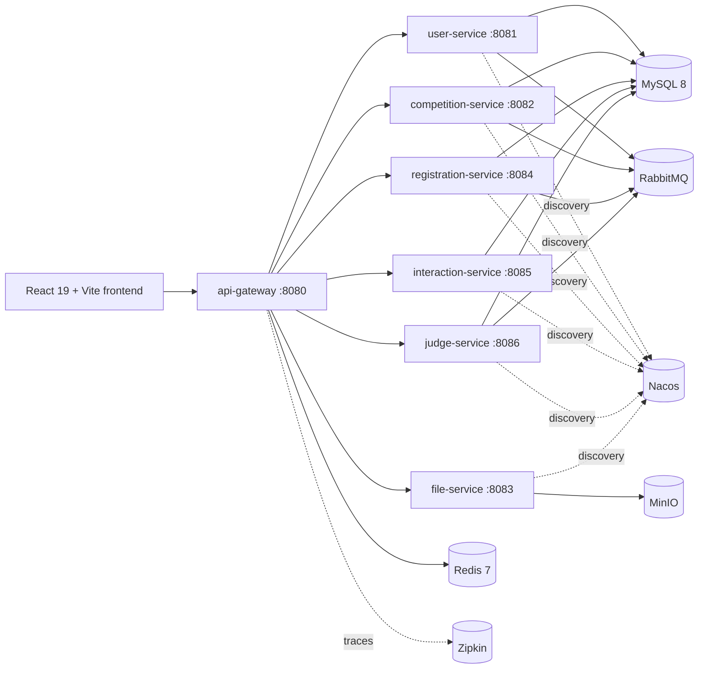

# Questora - Competition Management Platform

Enterprise competition management platform for hackathons, innovation challenges,
academic contests, and internal judging programs. The system combines a
Spring Boot microservices backend with a React/Vite frontend and a Docker Compose
local environment.

[](https://github.com/ShousenZHANG/project-contest-platform/actions/workflows/ci.yml)


## Contents

- [Product Scope](#product-scope)
- [Quick Start](#quick-start)
- [Local Development](#local-development)
- [Architecture](#architecture)
- [Service Matrix](#service-matrix)
- [Frontend Architecture](#frontend-architecture)
- [Backend Contracts](#backend-contracts)
- [Security](#security)
- [Accessibility](#accessibility)
- [Observability](#observability)
- [Testing](#testing)
- [CI/CD](#cicd)
- [Quality Gates](#quality-gates)
- [Project Structure](#project-structure)
- [Configuration](#configuration)
- [Operations](#operations)
- [Documentation](#documentation)
- [License](#license)

## Product Scope

Questora supports the full competition lifecycle:

- Public competition discovery and detail pages.
- JWT login, OAuth login, role-aware navigation, and user profiles.
- Admin, organizer, participant, and judge workflows.
- Competition creation, lifecycle management, media uploads, and visibility.
- Individual and team registrations.
- Submission upload, review assignment, scoring, winner selection, voting, and comments.
- RabbitMQ-backed notification events and SMTP email delivery.

## Quick Start

### Prerequisites

- Docker Desktop with Docker Compose
- Git
- Java 23 for local backend development
- Node.js 20+ for local frontend development

### 1. Configure Environment

```bash
git clone https://github.com/ShousenZHANG/project-contest-platform.git
cd project-contest-platform
cp .env.example .env
```

`.env.example` ships working local defaults — no edits are needed to run locally. Edit only for OAuth/email or a real deploy:

```env
# Infrastructure credentials — backend services read these via ${VAR:default},
# so the local stack works with the defaults below. Set strong values for deploys.
MYSQL_ROOT_PASSWORD=root        # MySQL container root password
MYSQL_USER=root                 # datasource user (all data services)
MYSQL_PASSWORD=root             # datasource password (all data services)
RABBITMQ_USER=guest
RABBITMQ_PASSWORD=guest
MINIO_ROOT_USER=minio
MINIO_ROOT_PASSWORD=minio123

# Auth & web
JWT_SECRET=change_me_256bit_hex_secret      # REQUIRED — gateway + user-service
CORS_ALLOWED_ORIGINS=http://localhost:3000  # comma-separated allowed origins
OAUTH_REDIRECT_BASE_URL=http://localhost:8080  # base host for OAuth callback URLs

# OAuth providers (only for social login)
GOOGLE_CLIENT_ID=
GOOGLE_CLIENT_SECRET=
GITHUB_CLIENT_ID=
GITHUB_CLIENT_SECRET=

# SMTP (only for email flows: password reset, notifications)
MAIL_USERNAME=
MAIL_PASSWORD=
```

`.env.example` ships consistent, working dev defaults, so `cp .env.example .env`
followed by the start command below brings the whole stack up with no further edits.
Infrastructure credentials also have `${VAR:default}` fallbacks in compose; only
`JWT_SECRET` has no fallback, which is why copying `.env` is step 1. For any shared
or production deploy you **must** replace every secret — at minimum `JWT_SECRET`,
`MYSQL_PASSWORD`, `RABBITMQ_PASSWORD`, and `MINIO_ROOT_PASSWORD` — restrict
`CORS_ALLOWED_ORIGINS`, and point `OAUTH_REDIRECT_BASE_URL` at your public gateway
host so OAuth callbacks resolve correctly.

### 2. Start the Stack

```bash
docker-compose up --build -d
```

The first run takes several minutes: Docker builds seven Java services and the
frontend, then initialises the MySQL, Nacos, RabbitMQ and MinIO volumes.

### 3. Verify It Came Up

The backends declare `start_period: 60s` and only start once the infrastructure
reports healthy, so **wait about three minutes** before judging the result.

```bash
docker-compose ps -a
```

**Use `-a`.** Without it Docker lists only running containers, so a service that
crashed on startup is simply absent from the output — which reads as a clean
stack rather than a broken one.

A successful stack is **14 containers `Up`**, 13 of them `healthy` (the frontend
declares no healthcheck):

| Group | Containers |
| --- | --- |
| Infrastructure | `9900-mysql`, `9900-redis`, `9900-rabbitmq`, `9900-nacos`, `9900-minio`, `9900-zipkin` |
| Backend | `backend-api-gateway`, `backend-user-service`, `backend-competition-service`, `backend-file-service`, `backend-registration-service`, `backend-interaction-service`, `backend-judge-service` |
| Frontend | `frontend-web` |

`health: starting` during the first couple of minutes is normal. `unhealthy` or
`Exited` after three minutes is not — see [Operations](#operations).

Then prove the whole path works, not just that processes are running:

```bash
curl http://localhost:8080/actuator/health
```

```bash
curl "http://localhost:8080/competitions/list?page=1&size=2"
```

The first must return `{"status":"UP",...}`. The second is the one that matters:
it goes through the gateway, resolves a service through Nacos, and reads MySQL,
so a valid paginated JSON body means routing, discovery and persistence are all
working. An empty `data` array is correct on a fresh database.

### 4. Open the Application

| Target | URL | Notes |
| --- | --- | --- |
| Frontend | http://localhost:3000 | React app served by the frontend container |
| API gateway | http://localhost:8080 | Gateway entrypoint for all API calls |
| API docs | http://localhost:8080/doc.html | Knife4j aggregated docs |
| RabbitMQ | http://localhost:15672 | Local default `guest` / `guest` |
| Nacos | http://localhost:8848/nacos | Nacos console |
| MinIO | http://localhost:9001 | Local default `minio` / `minio123` |
| Zipkin | http://localhost:9411 | Distributed tracing UI |

Jenkins is **not** part of the default stack. It sits behind a Compose profile so
`docker-compose up` brings up only the platform:

```bash
docker compose --profile ci up -d jenkins
```

It then serves on http://localhost:8888.

### 5. Stop the Stack

```bash
docker-compose down
```

Data lives in Docker named volumes, so a full reset is one flag:

```bash
docker-compose down -v
```

That drops the database, the broker state, and the object store together. Leave
`-v` off to keep your data between restarts.

## Local Development

### Backend

Windows:

```powershell
.\mvnw.cmd clean install
.\mvnw.cmd test
.\mvnw.cmd test -pl backend/user-service
.\mvnw.cmd test -pl backend/user-service -Dtest=JwtUtilTest
```

macOS/Linux:

```bash
./mvnw clean install
./mvnw test
./mvnw test -pl backend/user-service
./mvnw test -pl backend/user-service -Dtest=JwtUtilTest
```

When running services outside Docker, change infrastructure hostnames in each
`application.yml` from Docker service names such as `mysql`, `redis`, `nacos`,
and `rabbitmq` to local hosts or provide equivalent environment overrides.

### Frontend

```bash
cd frontend
npm install
npm run dev            # Vite dev server on :3000
npm test               # Jest unit and component tests
npm run build          # production build
```

End-to-end tests need a browser binary once per machine:

```bash
npx playwright install chromium
npm run test:e2e
```

`test:e2e` starts the dev server itself (`webServer` in `playwright.config.ts`)
and reuses one that is already running. The specs stub every network call with
`page.route`, so **no backend and no Docker stack are required**.

The frontend defaults to `http://localhost:8080` through `VITE_API_BASE_URL`.
During Vite development, `/api/*` is also proxied to the gateway and stripped to
the real backend route.

## Architecture


```mermaid
flowchart LR
  Browser["React 19 + Vite frontend"] --> Gateway["api-gateway :8080"]

  Gateway --> User["user-service :8081"]
  Gateway --> Competition["competition-service :8082"]
  Gateway --> File["file-service :8083"]
  Gateway --> Registration["registration-service :8084"]
  Gateway --> Interaction["interaction-service :8085"]
  Gateway --> Judge["judge-service :8086"]

  User --> MySQL[(MySQL 8)]
  Competition --> MySQL
  Registration --> MySQL
  Interaction --> MySQL
  Judge --> MySQL
  File --> MinIO[(MinIO)]

  Gateway --> Redis[(Redis 7)]
  User --> RabbitMQ[(RabbitMQ)]
  Competition --> RabbitMQ
  Registration --> RabbitMQ
  Judge --> RabbitMQ

  User -. discovery .-> Nacos[(Nacos)]
  Competition -. discovery .-> Nacos
  Registration -. discovery .-> Nacos
  Interaction -. discovery .-> Nacos
  Judge -. discovery .-> Nacos
  File -. discovery .-> Nacos

  Gateway -. traces .-> Zipkin[(Zipkin)]
```

Requests enter through the gateway. The gateway validates JWTs, applies public
route exemptions, routes to service instances through Nacos, and forwards the
current user identity with `User-ID` and `User-Role` headers.

## Service Matrix

| Module | Runtime port | Gateway routes | Responsibility |
| --- | ---: | --- | --- |
| `backend/api-gateway` | 8080 | All public API entrypoints | JWT validation, routing, CORS, docs aggregation |
| `backend/user-service` | 8081 | `/users/**`, `/teams/**` | Users, roles, OAuth, teams, notification emails |
| `backend/competition-service` | 8082 | `/competitions/**` | Competitions, organizers, judges, lifecycle metadata |
| `backend/file-service` | 8083 | `/files/**` | MinIO upload, download, delete, URL handling |
| `backend/registration-service` | 8084 | `/registrations/**`, `/submissions/**` | Registrations and submissions |
| `backend/interaction-service` | 8085 | `/interactions/**` | Submission votes and comments |
| `backend/judge-service` | 8086 | `/judges/**`, `/winners/**`, `/dashboard/**` | Scoring, reviews, winner selection, dashboard data |
| `backend/coverage-report` | N/A | N/A | JaCoCo aggregated coverage report module |

## Frontend Architecture

The frontend is a React 19 application built with Vite, Tailwind CSS 4,
Radix-based UI primitives, React Router 6, Axios, TanStack Query, Sonner,
Framer Motion, and Recharts.

Key conventions:

- `src/layouts/` owns shared application shells. Pages should not create fixed
  sidebars or fixed topbars locally.
- `src/components/ui/` contains Radix-style primitives and shared design-system
  building blocks.
- `src/shared/components/` contains reusable domain UI such as confirmation
  dialogs, empty states, loading states, and feedback surfaces.
- `src/api/apiClient.js` is the only Axios gateway client.
- `src/auth/authTokenManager.js` is the auth session boundary. Business UI
  should not read or write auth `localStorage` keys directly.
- `src/services/serviceUtils.js` normalizes Axios responses, standard
  `ApiResponse<T>` envelopes, and historical raw payloads.

### Data layer

Server state lives in TanStack Query, not in `useEffect` (ADR-0002):

- `src/api/queryKeys.js` is the only source of cache keys, and it also exports the
  `staleTime` tiers — `live`, `short`, `medium`, `long`. Two spellings of one key
  are two cache entries that drift apart silently.
- `src/api/queryFn.js` adapts the backend's four response shapes behind a single
  `unwrap()`, so components never see an envelope.
- `src/services/` is the only place a URL literal belongs, and every path there is
  checked against a real controller by a test (see [Testing](#testing)).
- Votes, comments, registration and team joins are optimistic writes with
  rollback.

### Motion

Three durations, defined once as CSS variables in `src/index.css` and consumed by
semantic classes (ADR-0001 decision 8):

| Class | Token | What it does |
|-------|-------|--------------|
| `motion-page` | `--motion-page` 150ms | Route content fading in, applied once per layout |
| `motion-card` | `--motion-card` 200ms | Hover lift for a card that navigates |
| `motion-dialog` / `motion-sheet` / `motion-popover` | `--motion-modal` 180ms | Radix surfaces, driven off `data-[state]` |

A component that writes its own `duration-*` has left the system.
`prefers-reduced-motion` is honoured once, globally, so no component checks for
it; `<MotionConfig reducedMotion="user">` covers framer-motion, which animates
from JavaScript and cannot see the CSS reset.

## Backend Contracts

Backend modules use DTO/VO/PO layering and the service-interface pattern:

- `domain/dto/` for request input.
- `domain/vo/` for response output.
- `domain/po/` for persistence entities.
- `service/I*Service.java` and `service/impl/*ServiceImpl.java` for business logic.
- `feign/` clients for service-to-service calls.
- `config/*RabbitMQConfig.java` for async event topology.

HTTP response policy:

- New JSON endpoints should return `ApiResponse<T>`.
- Controller success messages should use `ApiResponses.message(...)`.
- Errors are handled by each service-level `GlobalExceptionHandler`.
- File-service URL and Feign compatibility endpoints can keep raw string bodies
  where that contract is intentional.

Authentication policy:

- The gateway owns JWT validation.
- Public route exemptions are configured in `jwt.public-urls`.
- Authenticated controllers should receive identity through
  `@CurrentUser RequestContext`.
- Controller tests for authenticated routes should include both `User-ID` and
  `User-Role` headers.

## Security

Identity is enforced at the edge and validated in depth:

- **Single trusted identity source.** The gateway strips any client-supplied
  `User-ID` / `User-Role` headers on every request (including public paths) and
  re-injects them only after verifying the JWT, so downstream identity cannot be
  spoofed.
- **JWT.** HMAC-signed (Hutool) with expiry; logout/invalidation is tracked in
  Redis. The signing secret comes from `JWT_SECRET` with no hardcoded fallback.
- **OAuth.** GitHub and Google logins use a single-use, session-bound `state`
  nonce (CSRF protection), and callback URLs are environment-driven.
- **Passwords** are bcrypt-hashed; password reset is single-use, time-boxed, and
  returns a neutral response (no account enumeration).
- **CORS** is an explicit env-driven allowlist used with credentials — never `*`.
- **Input validation** uses Bean Validation (`@Valid` + constraints) at controller
  boundaries; uploads use UUID object keys (no path traversal) and never echo
  internal error messages to clients.
- **Secrets** are externalized to environment variables; none are committed.

> Before going live: set every secret in `.env`, restrict `CORS_ALLOWED_ORIGINS`,
> rotate default credentials, and keep backend service ports unmapped to the host
> (only the gateway `:8080` is exposed).

## Accessibility

WCAG 2.1 AA is enforced by tests, not asserted in prose. `frontend/e2e/a11y.spec.js`
runs axe-core over every public route, an authenticated route and an open dialog,
in **both light and dark mode**, and fails on any violation. The keyboard
behaviour axe cannot judge is asserted directly: the skip link is first in the tab
order, focus stays inside an open dialog, and whatever the keyboard reaches has a
visible ring.

Two rules follow from that and are easy to break by accident:

- **Every colour token clears 4.5:1** both as a fill under its `-foreground` and
  as text on the background, in both modes. Changing one means re-measuring it.
- **A new token needs its `-foreground` twin bridged in `@theme`**, or the
  utility silently resolves to nothing and text falls back to the body colour.

## Observability

- **Health & readiness** via Spring Boot Actuator (`/actuator/health`); details
  are shown only to authorized callers.
- **Metrics** exported in Prometheus format (`/actuator/prometheus`).
- **Distributed tracing** via Micrometer Tracing → Zipkin (`http://localhost:9411`).

## Testing

Three layers, each testing something the layer below cannot reach.

| Layer | Tool | Count | Runs against |
|-------|------|------:|--------------|
| Backend unit & slice | JUnit 5, Mockito, AssertJ, WireMock, H2 | — | No containers; H2 stands in for MySQL, WireMock for Feign targets |
| Frontend unit & component | Jest, Testing Library | 178 in 35 suites | jsdom, with a fresh `QueryClient` per test |
| End-to-end | Playwright (Chromium) | 35 in 7 specs | A real browser and the real dev server; network stubbed via `page.route` |

The E2E suite is 20 participant-flow tests plus 15 accessibility tests. Because it
stubs the network rather than calling a live backend, it exercises routing, React
Query, rendering and real user interaction without needing the Docker stack.

### Contract tests

Two tests exist to stop a specific class of bug that has bitten this repo before:
**a name that resolves to nothing**.

- `src/Tests/serviceRoutes.test.js` parses the Java controllers and fails the
  build if any URL in `src/services/` has no endpoint behind it. A service module
  once shipped with three methods pointing at routes that had never existed.
- `src/Tests/motionSystem.test.jsx` asserts the Radix primitives carry motion
  classes this project actually defines. They previously carried
  `tailwindcss-animate` class names for a plugin that was never installed, so
  every modal opened with no animation while the markup claimed otherwise.

### Commands

```bash
./mvnw test                       # backend, all modules
./mvnw verify                     # backend + JaCoCo coverage gates
cd frontend && npm test           # frontend unit and component
cd frontend && npm run test:e2e   # end-to-end + accessibility
```

On Windows use `.\mvnw.cmd` instead of `./mvnw`.

## CI/CD

Two pipelines with separate jobs. GitHub Actions gates changes; Jenkins ships them.

### Continuous integration — `.github/workflows/ci.yml`

Runs on every push to `master` and every pull request, as two parallel jobs:

| Job | Steps |
|-----|-------|
| Backend (Java 23) | `./mvnw -B verify` — unit tests, JaCoCo coverage, coverage gate. Uploads the aggregate report as a build artifact. |
| Frontend (Node 20) | `npm ci`, `npm test`, `npm run build`, then `npx playwright install --with-deps chromium` and `npm run test:e2e`. Uploads the Playwright report on failure. |

Neither job starts a service container. The backend suite is self-contained (H2
for MySQL, WireMock for the Feign targets) and the E2E specs stub the network, so
the whole gate runs on the two runners alone. Both jobs cache their dependencies,
and a new push cancels the in-flight run for the same branch.

### Continuous delivery — `Jenkinsfile`

Builds images and deploys the Compose stack:

1. **Checkout**
2. **Backend Build & Test** — `./mvnw -B verify`
3. **Frontend Build & Test** — `npm ci && npm test && npm run build`
4. **Security Scan** — Trivy filesystem scan (non-blocking)
5. **Docker Build** and **Deploy** — `docker compose build` then `up -d`
6. **Post-deploy Check** — container health

All images are multi-stage and run as a non-root user; Compose services declare
healthchecks and memory/CPU limits.

### Dependencies

`.github/dependabot.yml` opens grouped weekly update PRs for Maven, npm and the
workflow actions themselves.

## Quality Gates

### Coverage floors

`./mvnw verify` fails the build if a module drops below its coverage floor.
Floors are anti-regression baselines — current coverage rounded down — declared
per module as `jacoco.line.min` / `jacoco.branch.min`:

| Module | Line | Branch | Floor (line / branch) |
|--------|------|--------|-----------------------|
| interaction-service | 89.6% | 63.3% | 0.87 / 0.61 |
| file-service | 80.0% | 58.3% | 0.78 / 0.56 |
| common-lib | 79.5% | 100.0% | 0.75 / 0.90 |
| api-gateway | 78.2% | 47.5% | 0.76 / 0.45 |
| judge-service | 77.5% | 48.5% | 0.73 / 0.46 |
| registration-service | 74.8% | 63.4% | 0.72 / 0.60 |
| competition-service | 73.5% | 47.1% | 0.71 / 0.45 |
| user-service | 70.2% | 54.8% | 0.68 / 0.52 |
| **Aggregate** | **75.5%** | **56.8%** | — |

They are floors, not targets — raise them as coverage improves.

Coverage is spent where a mistake is expensive rather than spread evenly.
`common-lib` is at 100% branch because every service inherits it: the exception
handler that decides what seven APIs report, the identity every controller
authorises against, the enum that gates registration and submission.
`registration-service` was the priority after that — it owns the platform's most
consequential writes, and its guards' *failing* branches were the untested half,
which meant a guard could be deleted without turning the suite red.

### Local checks

Run these before committing changes:

```bash
./mvnw verify
```

```bash
cd frontend && npm test && npm run build && npm run test:e2e
```

On Windows, use `.\mvnw.cmd verify` instead of `./mvnw verify`.

Repository hygiene:

```bash
git diff --check && git status --short
```

Generated output must stay untracked — `frontend/coverage-summary/`,
`frontend/playwright-report/`, `frontend/test-results/`, `frontend/build/`, and
`.DS_Store`.

## Project Structure

```text
project-contest-platform/
|-- backend/
|   |-- api-gateway/
|   |-- common-lib/
|   |-- user-service/
|   |-- competition-service/
|   |-- file-service/
|   |-- registration-service/
|   |-- interaction-service/
|   |-- judge-service/
|   `-- coverage-report/
|-- frontend/
|   |-- src/
|   |   |-- api/            # apiClient, queryKeys, queryFn
|   |   |-- auth/           # authTokenManager — the only localStorage boundary
|   |   |-- components/ui/  # Radix/shadcn primitives
|   |   |-- context/
|   |   |-- layouts/        # AppShell, PublicLayout, PageTransition
|   |   |-- providers/      # QueryProvider, ThemeProvider
|   |   |-- routes/
|   |   |-- services/       # the only place a URL literal belongs
|   |   |-- shared/         # reusable domain UI and hooks
|   |   |-- Tests/          # Jest suites
|   |   |-- Admin/
|   |   |-- Organizer/
|   |   |-- Participant/
|   |   |-- PublicUser/
|   |   `-- Homepages/
|   |-- e2e/
|   |   |-- a11y.spec.js    # axe-core, light + dark, plus keyboard paths
|   |   `-- participant/    # participant flow specs
|   |-- Dockerfile
|   |-- playwright.config.ts
|   |-- package.json
|   `-- vite.config.js
|-- docs/
|   |-- CODEMAPS/
|   |-- adr/
|   `-- agents/
|-- mysql-init/
|-- docker-compose.yml
|-- pom.xml
|-- CONTEXT.md
|-- AGENTS.md
`-- CLAUDE.md
```

## Configuration

| Variable | Used by | Required | Purpose |
| --- | --- | --- | --- |
| `JWT_SECRET` | gateway, user-service | **Yes** | JWT signing/validation secret (no default) |
| `MYSQL_ROOT_PASSWORD` | MySQL container | Docker | MySQL container root password (default `root`) |
| `MYSQL_USER` / `MYSQL_PASSWORD` | all data services | Docker | Datasource credentials (default `root` / `root`) |
| `RABBITMQ_USER` / `RABBITMQ_PASSWORD` | RabbitMQ + producers | Docker | Broker credentials (default `guest` / `guest`) |
| `MINIO_ROOT_USER` / `MINIO_ROOT_PASSWORD` | MinIO + file-service | Docker | Object-store credentials (default `minio` / `minio123`) |
| `CORS_ALLOWED_ORIGINS` | gateway | Recommended | Comma-separated allowed origins (default `http://localhost:3000`) |
| `OAUTH_REDIRECT_BASE_URL` | user-service | OAuth / deploy | Base host for OAuth callback URLs (default `http://localhost:8080`) |
| `GOOGLE_CLIENT_ID` / `GOOGLE_CLIENT_SECRET` | user-service | OAuth only | Google OAuth credentials |
| `GITHUB_CLIENT_ID` / `GITHUB_CLIENT_SECRET` | user-service | OAuth only | GitHub OAuth credentials |
| `MAIL_USERNAME` / `MAIL_PASSWORD` | user-service | Email only | SMTP credentials |
| `VITE_API_BASE_URL` | frontend | Optional | API gateway base URL (default `http://localhost:8080`) |

Never commit `.env`, local database volumes, generated coverage output, or
browser test artifacts.

## Operations

### Everyday commands

```bash
docker-compose ps -a
```

```bash
docker-compose logs -f backend-api-gateway
```

```bash
docker-compose restart backend-api-gateway
```

### When a container will not start

Start by reading the status, then the log of whatever is not `Up`:

```bash
docker ps -a --format "table {{.Names}}\t{{.Status}}"
```

```bash
docker logs backend-api-gateway --tail 40
```

The exit code narrows it down immediately:

| Status | Meaning | Where to look |
| --- | --- | --- |
| `Exited (127)` | A command in the container was not found — usually a shell script | Confirm `wait-for-it.sh` has LF endings, not CRLF |
| `Exited (1)` | The application started and then failed | The log's first `ERROR`; usually configuration |
| `unhealthy` | The process runs, but its healthcheck fails | `docker inspect <name> --format '{{range .State.Health.Log}}{{.Output}}{{end}}'` |
| `Created`, never `Up` | Waiting on a dependency that never became healthy | Find the unhealthy dependency and fix that instead |

A healthcheck failure is not the same as a broken service. To see which health
indicator is at fault:

```bash
docker exec backend-user-service wget -q -O - http://localhost:8081/actuator/health
```

### Windows

Two problems on Windows are worth knowing about, both fixed in this repo but
easy to reintroduce:

- **Line endings.** `.gitattributes` pins `*.sh` and the Dockerfiles to LF. If a
  script is ever committed with CRLF, its shebang resolves to a binary named
  `bash\r` and the container exits 127 before printing anything.
- **Data volumes.** Stateful data uses Docker named volumes rather than host bind
  mounts. A bind mount cannot represent the file modes these images need —
  RabbitMQ in particular writes `.erlang.cookie` as mode 0400 and refuses to
  start if it comes back read-only.

### If the frontend loads but API calls fail

1. `backend-api-gateway` is `healthy` — the frontend can render without it.
2. Nacos is healthy and every backend has registered (http://localhost:8848/nacos).
3. `JWT_SECRET` is identical for the gateway and user-service.
4. The frontend `VITE_API_BASE_URL` points at the gateway.

The fastest single check is the cross-service call from
[step 3](#3-verify-it-came-up): if it returns JSON, routing, discovery and the
database are all fine and the problem is in the browser or in auth.

## Documentation

Read these before changing architecture, naming, or agent workflows:

- `CONTEXT.md` — the domain glossary. Actors, the core entities, the naming traps
  (`achieve` is a permanent misspelling of "archive"; `SubmissionRecords` is the
  table, **Submission** is the domain term), service boundaries, and the full
  catalogue of the seven RabbitMQ events.
- `docs/adr/` — decisions that should not be re-litigated:
  - **ADR-0001** — the shadcn/ui + Tailwind design system and the twelve choices behind it, including the motion system and the WCAG AA audit.
  - **ADR-0002** — data fetching on React Query, the query-key contract, and the optimistic-write policy.
  - **ADR-0003** — the cross-service gateway seam, and why a fallback reports an outage instead of faking absence.
- `docs/CODEMAPS/architecture.md` — system architecture and inter-service flow.
- `docs/CODEMAPS/frontend.md` — frontend routing, shell, and UI rules.
- `docs/CODEMAPS/dependencies.md` — runtime and dependency map.
- `AGENTS.md` — repository instructions for Codex agents.
- `CLAUDE.md` — repository instructions for Claude agents.

## License

This project is licensed under the MIT License. See `LICENSE` for details.
