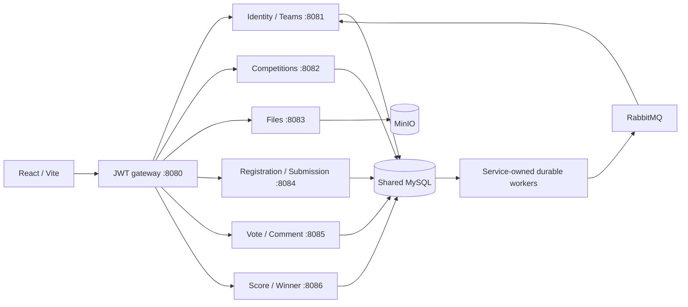

# Questora — Competition Management Platform

Questora manages hackathons, innovation challenges and academic contests with
individual or Team registration, private Submissions, Organizer Review, assigned
Judge scoring and automatic Winner selection.

**Verification scope · 2026-10-04:** the optimization baseline `b5f96a1` received
static source, interface and configuration checks. The CI repair follow-up uses
GitHub Actions to validate pushed commits; no local services, test suites, project
builds or deployments are started. The badge below follows `master`; exact-commit
results and remaining real-integration/release gates are recorded in the runbook.

[](https://github.com/ShousenZHANG/project-contest-platform/actions/workflows/ci.yml)


Start with the [project map](docs/CODEMAPS/README.md),
[domain vocabulary](CONTEXT.md), or the
[optimization and release runbook](docs/production-readiness-2026-10-04.md).
The [initial audit](docs/CODEMAPS/audit-2026-10-04.md) preserves its original findings;
the [architecture cleanup](docs/architecture-cleanup-2026-10-04.md) records the preceding refactor.

## Product scope

- Public competition discovery, approved individual/Team work and published results.
- JWT/OAuth entry points and separate Participant, Organizer, Judge and Admin workflows.
- Provider-subject OAuth identities, verified email metadata and password-only privileged accounts.
- Organizer creation, assignment, media management, registration and admissibility Review.
- Server-owned 0–10 equal-criterion scoring and current Submission revision checks.
- Three distinct valid assigned Judges for every approved entry before awarding.
- Repeatable automatic awards, tie ranking and immutable Winner score snapshots.
- Private Submission storage with authorized application downloads.
- Transactional notification/recovery tasks, Rabbit publisher confirmation and email inbox deduplication.
- Public/private read contracts, redacted contact details and retained competition/account history.

Judge entry uses its own scoring workspace. Lists retain URL filters and server
pagination; invalid actions reflect the server's lifecycle, pending changes prevent
repeat submission, and failures remain visible with a recovery action. Admin
competition management includes private competitions through a protected endpoint.

These are implementation features. Public TLS deployment, real provider OAuth,
production mail delivery and full accessibility/security assessments require the
separate release checks in the runbook.

## Quick start

Requirements: Docker Desktop with a Linux engine and Compose, Git, Java 25 for
local backend work, and Node 24 LTS for frontend work.

```bash
git clone https://github.com/ShousenZHANG/project-contest-platform.git
cd project-contest-platform
cp .env.example .env
docker compose up --build -d
docker compose ps -a
```

`.env.example` contains development values and configuration names. Replace every
secret before a shared deployment. User and service JWT secrets must be independent;
Nacos bootstrap credentials must match its data volume. OAuth and SMTP integrations
need their own configured credentials. Actual frontend/API/object origins are
environment variables; `VITE_API_BASE_URL` is baked into the frontend at build time.

Flyway completes before data services start. An exited successful migration or
bootstrap job is normal. Check its exit code, all required service health checks,
and a real API response:

```bash
curl http://localhost:8080/actuator/health
curl 'http://localhost:8080/competitions/list?page=1&size=2'
```

There is **no default administrator**. Follow the
[one-time bootstrap instructions](docs/production-readiness-2026-10-04.md#新环境部署)
to create the first account. An Admin can then provision Judge accounts. Public
signup offers Participant and Organizer only.

OAuth stores stable provider subjects in [V3](database/migrations/V3__stable_oauth_accounts.sql).
An email match alone never signs into an existing local account. Existing email-only
OAuth users recover their account through password reset; automatic linking to a
local or privileged account is unavailable. Callback credentials use a URL fragment
and are consumed and removed before the frontend paints.

Existing MySQL volumes require the
[schema audit and explicit baseline procedure](docs/production-readiness-2026-10-04.md#现有数据库和文件升级).
Changing bootstrap SQL does not migrate an existing volume.

| Surface | Local URL |
| --- | --- |
| Application | http://localhost:3000 |
| API gateway | http://localhost:8080 |
| Aggregated Springdoc UI | http://localhost:8080/doc.html |
| Nacos console | http://localhost:8849 |
| Rabbit management | http://localhost:15672 |
| MinIO console | http://localhost:9001 |
| Zipkin | http://localhost:9411 |

Management ports bind loopback; individual backend ports are reachable only in the
Compose network. Stop the stack with `docker compose down`; keep its data volumes
when retaining work.

The bundled [MinIO source image](infra/minio/Dockerfile) is a pinned local compatibility
build of an archived upstream release. For public hosting, configure a maintained
S3-compatible provider through the object-storage variables in `.env.example`.

## Local development

```bash
./mvnw clean verify
./mvnw test -pl backend/user-service -am
```

On Windows use `mvnw.cmd`. Runtime application configurations use Docker hostnames;
local JVM execution needs explicit infrastructure host overrides. Schema migration
is a separate prerequisite via `database/pom.xml` or the Compose migration service.

```bash
cd frontend
npm ci
npm run dev
npm test -- --runInBand
npx tsc --noEmit
npm run build
npm run test:e2e -- --retries=0
```

The dev server runs on port 3000. Production output is `frontend/build/` and remains
untracked, along with coverage, Playwright reports and test results.

## Architecture


```mermaid
flowchart LR
    Browser[React / Vite] --> Gateway[JWT gateway :8080]
    Gateway --> Users[Identity / Teams :8081]
    Gateway --> Competitions[Competitions :8082]
    Gateway --> Files[Files :8083]
    Gateway --> Registration[Registration / Submission :8084]
    Gateway --> Interaction[Vote / Comment :8085]
    Gateway --> Judging[Score / Winner :8086]
    Users --> DB[(Shared MySQL)]
    Competitions --> DB
    Registration --> DB
    Interaction --> DB
    Judging --> DB
    Files --> MinIO[(MinIO)]
    DB --> Tasks[Service-owned durable workers]
    Tasks --> Rabbit[RabbitMQ]
    Rabbit --> Users
```

Spring Boot 4.1, Java 25, Cloud/Alibaba discovery, MyBatis-Plus, Redis, RabbitMQ and
MinIO support seven services. Five share one schema; domain boundaries are code
ownership, not database isolation. Internal Feign calls use independent scoped
service credentials. Jackson 2 is a temporary Boot compatibility bridge preserving
the established HTTP and queued-message contract.

Frontend uses React 19, React Router 6, Tailwind 4, Radix, TanStack Query, Axios,
Sonner, Lucide, Framer Motion and Recharts. The current Indigo/Inter design system,
theme tokens and reduced-motion policy are retained. Session generation owns its
QueryClient and request lifetime, preventing late responses crossing accounts.

## Business and API contracts

The Organizer advances UPCOMING → ONGOING → COMPLETED; awarding advances to AWARDED.
Registration closes at the UTC deadline. Upload and Review accept ONGOING; Scoring
accepts COMPLETED. Criteria, dates, type and permitted files freeze after start.
Current revision and role/assignment determine score validity; incomplete approved
entries block awarding. Awarded results and assignments are immutable.

Most APIs use `ApiResponse<T>`. Paged reads use `PageResponse<T>`; internal values
and file-service compatibility strings retain their established shapes. Frontend
service URL literals are checked against actual Java controller routes.

Submission upload returns an application download route, not an anonymous object
URL. Public galleries and downloads require a public Competition and APPROVED work;
internal Review comments are excluded. Replacing a file resets Review/total and
increments its revision. Unknown historical score scales require rescoring rather
than implicit conversion.

Current score displays, statistics and database sorting require complete persisted
criteria and a valid assigned Judge at the current revision. Upload, Review and deletion
reload the current Submission under the shared lifecycle lock, so overlapping
file replacement cannot restore an older file, lose a revision or clean up a stale reference.

| Read surface | Access and meaning |
| --- | --- |
| `/competitions/list`, `/competitions/{id}` | Public competitions only |
| `/competitions/managed/{id}` | Admin, actual Organizer, assigned Judge or registered entrant |
| `/competitions/admin/list` | Admin inventory, including private competitions |
| `/submissions/public/**`, `/winners/public-list`, `/dashboard/public/**` | Public competitions and eligible public data; arbitrary `userId` cannot expose private score/review |
| `/dashboard/statistics`, `/winners/list` | Managed views derive identity and authorization on the server |
| `/registrations/public/{id}/teams`, `/registrations/teams/list` | Public roster and authorized managed roster use separate routes/cache keys |
| `/registrations/teams/{id}/competitions` | Admin or actual Team creator/member only; private registration/score history stays within the Team |
| `/users/query-by-ids`, `/users/{id}`, public Team profiles | Public profile fields; contacts are redacted except an Admin's or the account owner's authorized view |
| Internal user/team/submission/statistics reads | Scoped service credentials and explicitly allowed callers; public gateway blocks internal routes |

Comments and votes require a public APPROVED Submission. Only Participants create
or edit interactions; moderators remove comments within their authorized scope.
Deleting an account with competition, Team, scoring or interaction history is
rejected, and deleting the last Admin is rejected. Deleting a Team retains its
registration/submission history. Password changes revoke the old active session.

Media and avatar changes use their dedicated upload endpoints. Replacements retain
the previous object until database commit and enqueue deletion in the same
transaction; rollback cleanup records the new object for retry. A process crash
between external upload and recording compensation can still leave an orphan;
reference reconciliation is documented in the runbook.

## Testing and accessibility

Maven `verify` runs backend unit, MVC, protocol and real H2 transaction tests, then
the original module coverage floors. Jest tests components and service/session
contracts. Browser tests use representative populated fixtures at mobile, tablet
and desktop widths, light/dark themes, keyboard and reduced motion.

| Module | JaCoCo line / branch floor |
| --- | --- |
| common-lib | 75% / 90% |
| api-gateway | 76% / 45% |
| user-service | 68% / 52% |
| competition-service | 71% / 45% |
| file-service | 78% / 56% |
| registration-service | 72% / 60% |
| interaction-service | 87% / 61% |
| judge-service | 73% / 46% |

Axe and contrast checks cover automated criteria, not all of WCAG.
[WCAG 2.2 AA](https://www.w3.org/TR/WCAG22/) is the accessibility target. Manual
assistive-technology review and production performance remain separate checks.
See the runbook for the baseline static review, exact-commit remote CI results
and remaining release checks.

## CI/CD

[GitHub Actions](.github/workflows/ci.yml) uses Java 25 and Node 24, Maven verify,
Jest, type checking, production build and zero-retry browser regression. The local
integration override reuses verified packaged jars to avoid seven repeated Maven
builds. Its smoke script exercises real gateway/discovery/database/file/score paths.

Jenkins requires an agent with the documented Java/Node tools. Deployment configuration
comes from a complete managed environment file; storing a secret in `.env.example`
or overwriting a workspace `.env` is not a deployment mechanism.

`master` is the sole retained local and origin branch. Previous Dependabot tips were
archived in a local Git bundle before removal. Scheduled version PRs are paused;
security-update settings and future collaborator branches remain separate concerns.

## Operations

Use `docker compose ps -a`, migration/bootstrap exit codes, component health,
gateway API queries and service logs to diagnose startup. Health alone is not a
complete competition workflow check. Metrics/Prometheus endpoints and Zipkin traces
are configured; deploying a scraper, alerts, persistent tracing and retention is
the hosting environment's responsibility.

Inspect durable-task owner, state, attempts, lease and age. Resolve the cause before
replaying DEAD work; email can duplicate after an ambiguous SMTP success. Database
and object backups, restore rehearsal, old default-Admin credentials, historical
time semantics and old object-policy cutover are covered in the
[operations runbook](docs/production-readiness-2026-10-04.md).

## License

MIT. See [LICENSE](LICENSE).
