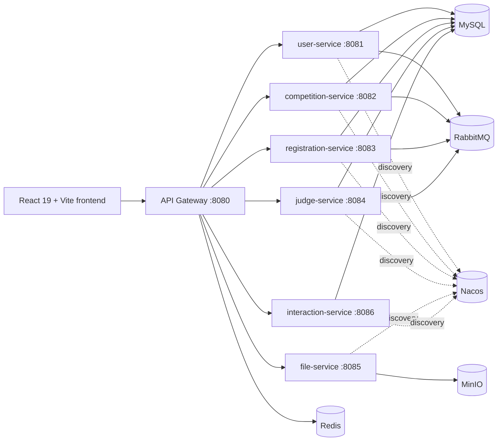

<!-- Updated: 2026-05-06 -->
# Architecture Overview

## System Flow

## Auth Flow

1. Browser sends JWT to `api-gateway`.
2. `JwtAuthFilter` validates the token and injects `User-ID` and `User-Role`.
3. Downstream controllers receive identity through `@CurrentUser RequestContext`.
4. Frontend session state goes through `authTokenManager`; business UI should not touch auth `localStorage` directly.

## Response Contract

- Errors use the shared `GlobalExceptionHandler` and return `ApiResponse<T>`.
- Controller success messages use `ApiResponses.message(...)`.
- File-service upload endpoints intentionally keep raw string bodies for file URL and Feign compatibility.
- Frontend service calls can use `unwrapApiPayload` to consume both standard envelopes and historical raw payloads.

## Inter-Service Communication

- competition-service -> user-service, file-service
- registration-service -> user-service, file-service, competition-service
- judge-service -> user-service, registration-service, competition-service, interaction-service
- interaction-service -> user-service, registration-service
- user-service -> registration-service, file-service, GitHub/Google OAuth APIs

## RabbitMQ Event Flows

- `competition.topic`: judge assignment/removal notifications
- `registration.topic`: registration and submission notifications
- `judge.topic`: winner award notifications

User-service consumes notification events and sends email through SMTP.
