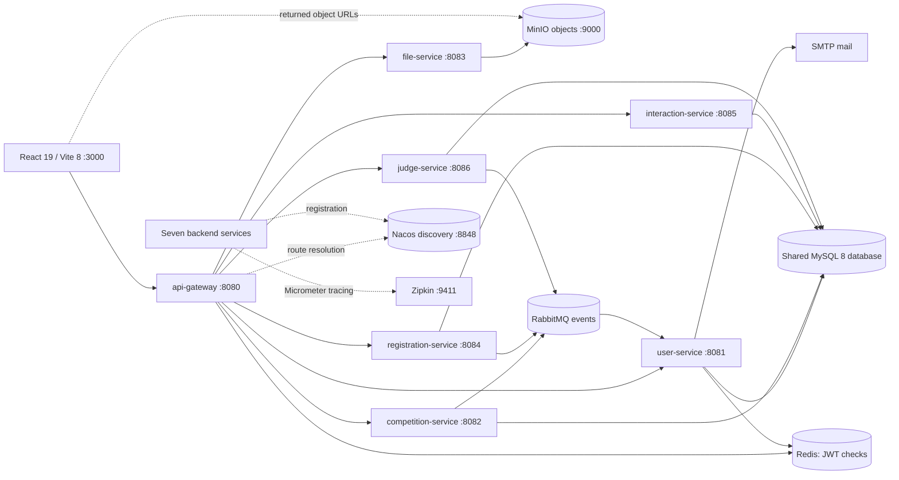
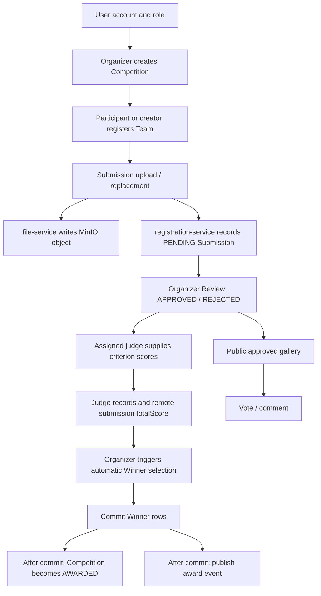

<!-- Verified: 2026-10-04; source baseline: 8074df1 -->
# Architecture map

Start at the [map index](README.md). This map describes the scanned implementation;
[audit findings](audit-2026-10-04.md) separate intended rules from actual behavior.

## Runtime topology

```mermaid
flowchart LR
  Browser["React 19 / Vite 8 :3000"] --> Gateway["api-gateway :8080"]
  Gateway --> User["user-service :8081"]
  Gateway --> Competition["competition-service :8082"]
  Gateway --> File["file-service :8083"]
  Gateway --> Registration["registration-service :8084"]
  Gateway --> Interaction["interaction-service :8085"]
  Gateway --> Judge["judge-service :8086"]
  User --> DB[("Shared MySQL 8 database")]
  Competition --> DB
  Registration --> DB
  Interaction --> DB
  Judge --> DB
  Gateway --> Redis[("Redis: JWT checks")]
  User --> Redis
  File --> MinIO[("MinIO objects :9000")]
  Browser -. "returned object URLs" .-> MinIO
  Competition --> MQ[("RabbitMQ events")]
  Registration --> MQ
  Judge --> MQ
  MQ --> User
  User --> SMTP["SMTP mail"]
  Gateway -. "route resolution" .-> Nacos[("Nacos discovery :8848")]
  Services["Seven backend services"] -. "registration" .-> Nacos
  Services -. "Micrometer tracing" .-> Zipkin["Zipkin :9411"]
```

[Compose](../../docker-compose.yml) defines 14 default containers: seven backend
services, frontend, and six infrastructure services. Jenkins is additional and
uses the `ci` profile. The frontend Docker image serves a static SPA; its local
Vite proxy is not a production reverse proxy. Five data services share one schema
and overlapping tables; see the [data map](data.md).

## Code boundaries

| Area | Entry point | Responsibility |
| --- | --- | --- |
| Browser | [main.jsx](../../frontend/src/main.jsx), [App.jsx](../../frontend/src/App.jsx) | Providers, lazy routes, public/authenticated layouts |
| Session | [authTokenManager.js](../../frontend/src/auth/authTokenManager.js), [AuthContext.jsx](../../frontend/src/context/AuthContext.jsx) | Token storage and current account |
| Server state | [QueryProvider.jsx](../../frontend/src/providers/QueryProvider.jsx), [queryKeys.js](../../frontend/src/api/queryKeys.js) | Query cache and invalidation |
| HTTP adapter | [apiClient.js](../../frontend/src/api/apiClient.js), [services](../../frontend/src/services) | Gateway base URL, headers, domain API calls |
| Edge | [JwtAuthFilter.java](../../backend/api-gateway/src/main/java/com/w16a/danish/gateway/filters/JwtAuthFilter.java), [configuration](../../backend/api-gateway/src/main/resources/application.yml) | JWT verification, public URL policy, identity, routing |
| Contracts | [common-lib](../../backend/common-lib/src/main/java/com/w16a/danish/common) | RequestContext, errors, enums, DTO/VO contracts |
| Domain | [backend map](backend.md) | Controllers, guards, persistence, Feign/gateway seams |
| Operations | [dependencies map](dependencies.md) | Java/Node, Docker, CI, deployment |

Seven backend services execute independently. `common-lib` and the coverage
aggregate are Maven modules without runtime ports. Controllers call MyBatis-Plus
services. OpenFeign provides cross-service calls; registration-service and
judge-service hide competition responses behind `CompetitionGateway`, following
[ADR-0003](../adr/0003-cross-service-gateway-seam.md).

## Business flow

```mermaid
flowchart TD
  Account["User account and role"] --> Competition["Organizer creates Competition"]
  Competition --> Registration["Participant or creator registers Team"]
  Registration --> Upload["Submission upload / replacement"]
  Upload --> Object["file-service writes MinIO object"]
  Upload --> Submission["registration-service records PENDING Submission"]
  Submission --> Review["Organizer Review: APPROVED / REJECTED"]
  Review --> Gallery["Public approved gallery"]
  Review --> Score["Assigned judge supplies criterion scores"]
  Score --> Total["Judge records and remote submission totalScore"]
  Total --> Award["Organizer triggers automatic Winner selection"]
  Award --> Winners["Commit Winner rows"]
  Winners --> Status["After commit: Competition becomes AWARDED"]
  Winners --> Email["After commit: publish award event"]
  Gallery --> Interaction["Vote / comment"]
```

| Stage | Owner | Actual enforcement and side effects |
| --- | --- | --- |
| Competition | competition-service | Enum has UPCOMING, ONGOING, COMPLETED, AWARDED, CANCELED. Status write validates the enum but lacks actor/transition checks. |
| Registration | registration-service | Individual/Team tables and creator/participant guards; synchronous RabbitMQ publication. |
| Submission | registration-service + file-service | Remote upload then local write. Individual and Team submission use different status guards. Organizer Review and Judge Score are distinct. |
| Score | judge-service | Submitted criterion weights determine the judge total. Assignment is checked against requested competition, but score writes do not validate submission membership/APPROVED. Recalculated total is sent to registration after commit. |
| Winner | judge-service | Rank scored submissions, commit Winner rows, then update status/notify. Does not enforce documented COMPLETED prerequisite or the scored-list UI's minimum judge count. |
| Interaction | interaction-service | Reads User/Submission through Feign; schema enforces one vote per user per submission. |

[CONTEXT.md](../../CONTEXT.md) defines domain vocabulary. Its stronger claims
about scoring eligibility, awarding prerequisites, galleries, and notification
failure isolation have implementation gaps documented in the audit.

## Authentication and trust

The gateway strips inbound `User-ID`/`User-Role` on every request. Authenticated
routes verify JWT signature, expiry, Redis blacklist, and latest stored token,
then inject trusted identity. `@CurrentUser RequestContext` reads those headers.

JWT authentication does not enforce role or object authorization. Prefix routes
forward complete `/users/**`, `/submissions/**`, `/files/**`, etc.; discovery
routes are also enabled. `@Operation(hidden = true)` hides API documentation,
not reachability. Internal writes and generic file deletion lack protection at
the controller/service boundary. Public registration also assigns a requested
role, including Admin; restricting choices in the browser does not constrain
direct API requests.

## HTTP contracts

- `ApiResponse<T>` is the usual success/error envelope.
- `PageResponse<T>` is returned directly by paginated endpoints.
- Login/registration return raw `UserResponseVO`; internal endpoints return bare
  values; file uploads return raw URLs.
- [queryFn.js](../../frontend/src/api/queryFn.js) and
  [serviceUtils.js](../../frontend/src/services/serviceUtils.js) normalize shapes.

The frontend service contract test matches HTTP verb and path to controllers.
It does not validate permissions, payloads, response fields, or whether a static
homepage ID names a real Competition/Submission.

## Cross-service calls and events

| Caller | Collaborators |
| --- | --- |
| user-service | registration-service, file-service, GitHub/Google OAuth, Redis, SMTP |
| competition-service | user-service, file-service, RabbitMQ |
| registration-service | user-service, file-service, CompetitionGateway, RabbitMQ |
| judge-service | user-service, registration-service, interaction-service, CompetitionGateway, RabbitMQ |
| interaction-service | user-service, registration-service |
| file-service | MinIO |

RabbitMQ exchanges are `competition.topic`, `registration.topic`, `judge.topic`;
user-service consumes events and sends emails. Most publishers call
`convertAndSend` without catching failures. Award publication and score
propagation use transaction callbacks, but have no persistent outbox/durable
retry. See [data consistency](data.md).

## Verification boundary

[Dated evidence](audit-2026-10-04.md) records tests and reproduced defects. JVM
tests and browser fixtures do not establish live
gateway/Nacos/MySQL/MinIO behavior. Docker Desktop's Linux engine was unavailable;
live stack health, OAuth, SMTP, and broker/object-store state remain unverified.
Participant/authenticated browser fixtures stub APIs; public accessibility scans
can inspect a fallback surface when their unstubbed backend request fails.
