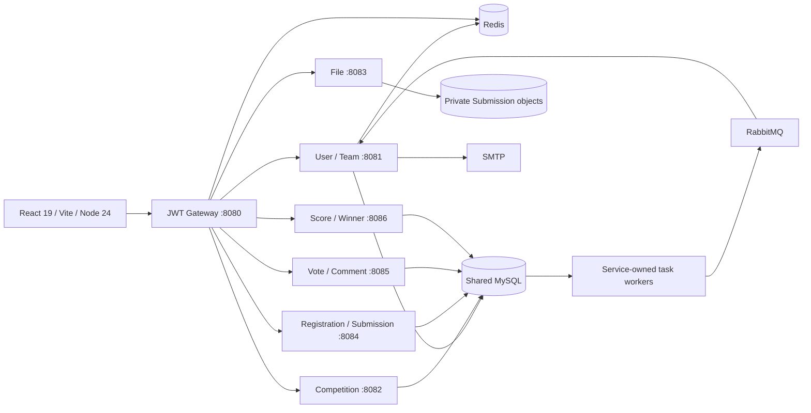
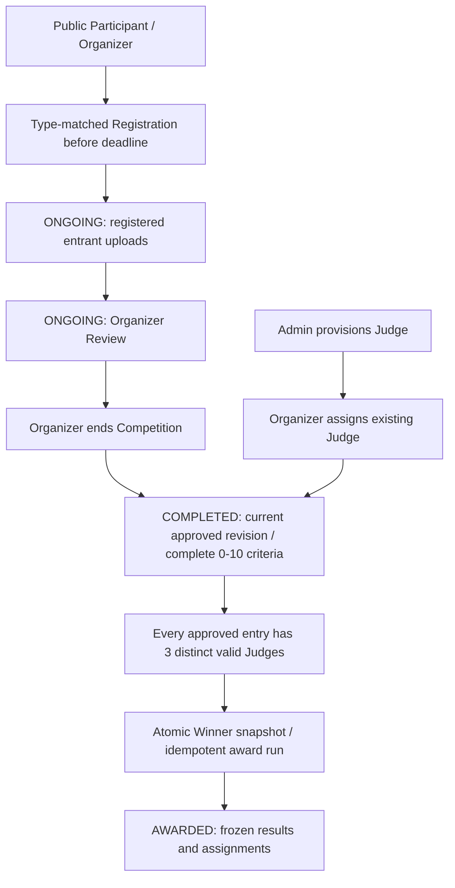

# Architecture map

Updated 2026-10-04 for the accepted public-platform optimization. The
[initial audit](audit-2026-10-04.md) is historical evidence; current release evidence
and remaining gates live in the [runbook](../production-readiness-2026-10-04.md).

## Runtime and trust

```mermaid
flowchart LR
    Browser[React 19 / Vite / Node 24] --> Gateway[JWT Gateway :8080]
    Gateway --> User[User / Team :8081]
    Gateway --> Competition[Competition :8082]
    Gateway --> File[File :8083]
    Gateway --> Registration[Registration / Submission :8084]
    Gateway --> Interaction[Vote / Comment :8085]
    Gateway --> Judge[Score / Winner :8086]
    User --> Redis[(Redis)]
    Gateway --> Redis
    User --> DB[(Shared MySQL)]
    Competition --> DB
    Registration --> DB
    Interaction --> DB
    Judge --> DB
    File --> ObjectStore[(Private Submission objects)]
    DB --> Tasks[Service-owned task workers]
    Tasks --> Rabbit[RabbitMQ]
    Rabbit --> User
    User --> Mail[SMTP]
```

Five data services share one schema. File-service has no domain database. Internal
Feign traffic bypasses the edge gateway, uses Nacos discovery and scoped service
credentials; [ADR-0008](../adr/0008-service-credentials-and-private-submissions.md)
records the shared signing-secret tradeoff. Nacos admin and service credentials
are separate. Infrastructure management interfaces bind loopback, and backend
service ports stay inside the Compose network.

[JwtAuthFilter](../../backend/api-gateway/src/main/java/com/w16a/danish/gateway/filters/JwtAuthFilter.java)
rejects internal and ambiguous paths before the public whitelist, disables forged
identity/service headers, and injects verified user identity. Discovery aliases are
disabled; explicit documentation routes remain. Downstream user `RequestContext`
still depends on trusted gateway/network delivery, while service-only routes verify
their own credential.

## Business authority

```mermaid
flowchart TD
    Signup[Public Participant / Organizer] --> Registration[Type-matched Registration before deadline]
    Admin[Admin provisions Judge] --> Assignment[Organizer assigns existing Judge]
    Registration --> Upload[ONGOING: registered entrant uploads]
    Upload --> Review[ONGOING: Organizer Review]
    Review --> End[Organizer ends Competition]
    End --> Score[COMPLETED: current approved revision / complete 0-10 criteria]
    Assignment --> Score
    Score --> Eligibility[Every approved entry has 3 distinct valid Judges]
    Eligibility --> Award[Atomic Winner snapshot / idempotent award run]
    Award --> Final[AWARDED: frozen results and assignments]
```

The deadline closes registration and upload independently of manual status.
Configured criteria/type/dates/file types freeze at start. Review and Submission
writes freeze at COMPLETED. A shared Competition run lock serializes these writes
and awarding; locked current-status reads avoid MySQL repeatable-read stale snapshots.
See [ADR-0006](../adr/0006-scoring-and-competition-lifecycle.md).

## Code seams

| Area | Authority | Supporting seam |
| --- | --- | --- |
| Account privilege | user-service | Public role whitelist, Admin provisioning, stable OAuth subject bindings, explicit bootstrap CLI |
| Competition lifecycle | competition-service | CompetitionLifecycle and shared run lock |
| Submission revision and access | registration-service | SubmissionDownloads, streamed gateway downloads, rollback/file cleanup |
| Scoring | judge-service | ScoringPolicy, current revision/schema and valid Judge SQL reads |
| Award eligibility and snapshot | judge-service | All APPROVED entries, persisted award run, tie ranking |
| Cross-service reads | CompetitionGateway | Feign/status/missing-value normalization, ADR-0003 |
| External effects | DurableTasks | Local transaction enqueue, leases/retry/DEAD, ADR-0007 |
| Notification protocol | common-lib messaging | Seven payloads and historical wire IDs, ADR-0005 |
| Browser session | authTokenManager + QueryProvider | Generation-bound cache and requests, ADR-0004 |
| Design and data fetching | Existing Radix/token and Query layers | ADR-0001 and ADR-0002 |

## Response and visibility

`ApiResponses` supplies standard success/error envelopes. Paged reads and several
VO/Boolean endpoints retain bare responses; file-service compatibility uploads
retain raw strings. Frontend `unwrap` and route-contract tests cover these shapes.

Submission DTOs expose application download paths. Public views require public
Competitions and approved work and omit internal Review comments. Application
downloads check ownership, Team membership, actual Organizer, assigned Judge or
the public-approved case, then stream only a known bucket/key. No historical URL
host is fetched.

Competition metadata has separate public, managed and Admin-inventory reads.
Public profile views redact email; trusted internal lookups use scoped service
routes. Public dashboards cannot derive personal score/Review from an arbitrary
user ID. Comment/vote access requires public approved work; mutations require the
Participant role, while comment moderation checks its actual Competition scope.
OAuth requires a stable provider subject and verified email metadata and never
implicitly links a local account by email. Privileged accounts use password login.

## Recovery and verification

Domain transactions insert effects into the shared durable task table. Notifications
use confirmed persistent Rabbit publication; user-service persists inbox deduplication
and email work before ack. Score projection includes both version and revision.
File deletion follows committed replacement/deletion; failed upload cleanup has a
new transaction. SMTP remains at least once after ambiguous success.

Flyway V1/V2/V3 and Nacos bootstrap complete before runtime services. Test reports,
isolated real infrastructure and public deployment are different evidence layers;
consult the runbook for what was actually checked statically. No services, builds,
tests or migrations were run in this delivery. Local MinIO source fallback is
not a statement that the archived upstream is maintained for public deployment.
