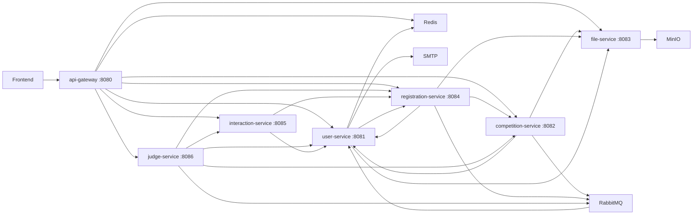

# Backend code map

Scanned from the working tree on **2026-10-04**. Inventory: **252 production Java files, 48 test Java files, 7 executable services, 10 REST controllers, 114 controller endpoint declarations, 17 Feign clients, 2 domain gateways, 4 notification publishers**. Counts exclude generated `target/` output.

This map describes implementation, including differences from [CONTEXT.md](../../CONTEXT.md). B01-B03 have isolated runtime reproductions using real business methods/MockMvc with mocked persistence, Redis or service collaborators. Local evidence: `.git/audit/2026-10-04/AuditProbe.java` and `security-probes.log`. B15 has a real MyBatis-Plus SQL-generation reproduction in `SubmissionResetSqlProbe.java` / `submission-reset-sql.log` in that same directory. These are not live deployed-stack requests or real DB persistence tests. Other findings are static inspection; live database, MinIO and RabbitMQ behavior remains unverified here. Current test/coverage results belong in the scan report; configured floors below are not measured coverage.

## Service topology



Sibling-service calls use Nacos discovery and Feign directly, bypassing the edge gateway. Six domain services share one MySQL database. Registration-service reads `competition_organizers` locally; judge-service reads `competition_judges` locally. [Schema](../../mysql-init/create_table.sql) foreign keys/cascades span logical ownership; the service boundaries do not provide physical database isolation.

| Module | Production / test Java | Entry point | Main responsibility |
|---|---:|---|---|
| api-gateway | 6 / 2 | [GatewayApplication](../../backend/api-gateway/src/main/java/com/w16a/danish/gateway/GatewayApplication.java) | Routes, JWT verification, identity header sanitization, CORS |
| user-service | 70 / 9 | [UserServiceApplication](../../backend/user-service/src/main/java/com/w16a/danish/user/UserServiceApplication.java) | Accounts, roles, OAuth, password resets, Teams, notification emails |
| competition-service | 31 / 5 | [CompetitionServiceApplication](../../backend/competition-service/src/main/java/com/w16a/danish/competition/CompetitionServiceApplication.java) | Competitions, ownership, media, judge assignments, lifecycle writes |
| file-service | 8 / 3 | [FileServiceApplication](../../backend/file-service/src/main/java/com/w16a/danish/fileService/FileServiceApplication.java) | File validation and MinIO upload/delete |
| registration-service | 50 / 10 | [RegistrationServiceApplication](../../backend/registration-service/src/main/java/com/w16a/danish/registration/RegistrationServiceApplication.java) | Registrations, Submissions, Organizer Review, participant/submission analytics |
| interaction-service | 18 / 3 | [InteractionServiceApplication](../../backend/interaction-service/src/main/java/com/w16a/danish/interaction/InteractionServiceApplication.java) | Comments, replies, votes, interaction reporting |
| judge-service | 51 / 10 | [JudgeServiceApplication](../../backend/judge-service/src/main/java/com/w16a/danish/judge/JudgeServiceApplication.java) | Judge Score, score aggregation, automatic awarding, dashboards |
| common-lib | 18 / 6 | Library, no server | RequestContext, shared DTO/VO/enums, responses, exceptions, MVC resolution |
| coverage-report | 0 / 0 | [Aggregate POM](../../backend/coverage-report/pom.xml) | JaCoCo aggregate report in Maven `verify` |

The parent [pom.xml](../../pom.xml) declares Java 23, Spring Boot 3.4.3, Spring Cloud 2024.0.1 and Alibaba Cloud 2023.0.3.2. Ports, discovery, route predicates and anonymous whitelist are in [gateway application.yml](../../backend/api-gateway/src/main/resources/application.yml). Service configurations use Docker infrastructure names. See [dependencies map](dependencies.md) for deployment wiring.

## Identity and response boundaries

- [JwtAuthFilter](../../backend/api-gateway/src/main/java/com/w16a/danish/gateway/filters/JwtAuthFilter.java) removes inbound `User-ID`/`User-Role` on every request. Protected paths require Bearer JWT; verified claims become downstream headers. Public whitelist matching runs before JWT parsing, so a token on a public path does not establish a downstream RequestContext.
- [Gateway JwtUtil](../../backend/api-gateway/src/main/java/com/w16a/danish/gateway/util/JwtUtil.java) checks Redis blacklist, signature, `exp` and latest token when its Redis record exists. Missing `jwt:token:<userId>` does not itself reject JWT. Redis exceptions produce authentication failure.
- [RequestContextArgumentResolver](../../backend/common-lib/src/main/java/com/w16a/danish/common/context/RequestContextArgumentResolver.java) requires both headers and trusts their origin; it does not verify JWT. [RequestContext](../../backend/common-lib/src/main/java/com/w16a/danish/common/context/RequestContext.java) supplies role guards. Controllers opt in with `@CurrentUser`; service methods enforce role/ownership checks.
- Sibling endpoints have no separate service-identity authentication. Network isolation and explicit guards matter. Edge routes do **not** exclude `/internal/`; the name and OpenAPI `hidden=true` annotation provide no access boundary (B02-B03).
- [ApiResponses](../../backend/common-lib/src/main/java/com/w16a/danish/common/web/ApiResponses.java) and [GlobalExceptionHandler](../../backend/common-lib/src/main/java/com/w16a/danish/common/exception/GlobalExceptionHandler.java) implement `{success,data,error}` and domain status codes. Paged reads and many detail/Boolean/VO reads are bare values. Files return raw strings; OAuth redirects. Bare responses are not limited to internal endpoints.

## Domain seams

| Domain | Start here | Storage / behavior |
|---|---|---|
| Accounts | [UsersServiceImpl](../../backend/user-service/src/main/java/com/w16a/danish/user/service/impl/UsersServiceImpl.java), [PasswordUtil](../../backend/user-service/src/main/java/com/w16a/danish/user/util/PasswordUtil.java), [JwtUtil](../../backend/user-service/src/main/java/com/w16a/danish/user/util/JwtUtil.java) | `users`, `roles`, `user_roles`; bcrypt, Redis sessions/reset tokens, GitHub/Google OAuth |
| Teams | [TeamServiceImpl](../../backend/user-service/src/main/java/com/w16a/danish/user/service/impl/TeamServiceImpl.java) | `team`, `team_members`; creator-only edit/member removal, creator/Admin delete with remote registration/Submission checks; creator cannot leave |
| Competitions | [CompetitionsServiceImpl](../../backend/competition-service/src/main/java/com/w16a/danish/competition/service/impl/CompetitionsServiceImpl.java) | `competitions`, `competition_organizers`, `competition_judges`; normal writes use ownership/Admin checks; status action lacks caller guard |
| Registrations | [CompetitionParticipantsServiceImpl](../../backend/registration-service/src/main/java/com/w16a/danish/registration/service/impl/CompetitionParticipantsServiceImpl.java) | `competition_participants`, `competition_teams`; Participant-only writes, creator-only Team registration/cancel; Organizer removal; individual removal lacks Team removal's Admin exception |
| Submissions/Review | [SubmissionRecordsServiceImpl](../../backend/registration-service/src/main/java/com/w16a/danish/registration/service/impl/SubmissionRecordsServiceImpl.java) | `submission_records`; replacement sets PENDING and attempts to clear total/Review metadata (B15); Admin or competition Organizer reviews; individual delete owner/Organizer/Admin, Team delete member/Admin |
| Reporting | [ParticipantAnalyticsServiceImpl](../../backend/registration-service/src/main/java/com/w16a/danish/registration/service/impl/ParticipantAnalyticsServiceImpl.java), [SubmissionAnalyticsServiceImpl](../../backend/registration-service/src/main/java/com/w16a/danish/registration/service/impl/SubmissionAnalyticsServiceImpl.java) | Read counts/trends; scored query checks non-null total, not approval/Judge count |
| Interactions | [SubmissionCommentsServiceImpl](../../backend/interaction-service/src/main/java/com/w16a/danish/interaction/service/impl/SubmissionCommentsServiceImpl.java), [SubmissionVotesServiceImpl](../../backend/interaction-service/src/main/java/com/w16a/danish/interaction/service/impl/SubmissionVotesServiceImpl.java) | `submission_comments`, `submission_votes`; edit owner-only, delete owner/Admin/Organizer; duplicate vote 409 with DB unique key |
| Judge Score | [SubmissionJudgesServiceImpl](../../backend/judge-service/src/main/java/com/w16a/danish/judge/service/impl/SubmissionJudgesServiceImpl.java), [SubmissionJudgeScoresServiceImpl](../../backend/judge-service/src/main/java/com/w16a/danish/judge/service/impl/SubmissionJudgeScoresServiceImpl.java) | `submission_judges`, `submission_judge_scores`; initial assignment/deadline checks; client criteria/weights; mean Judge total propagated after commit |
| Winners | [SubmissionWinnersServiceImpl](../../backend/judge-service/src/main/java/com/w16a/danish/judge/service/impl/SubmissionWinnersServiceImpl.java) | `submission_winners`; Organizer/Admin permission; total ranking/criterion awards; replaces winners, status/email after commit |
| Dashboard | [DashboardServiceImpl](../../backend/judge-service/src/main/java/com/w16a/danish/judge/service/impl/DashboardServiceImpl.java) | Remote competitions/registrations/Submissions/interactions and local judging data |
| Files | [FileStorageServiceImpl](../../backend/file-service/src/main/java/com/w16a/danish/fileService/service/impl/FileStorageServiceImpl.java), [FileValidator](../../backend/file-service/src/main/java/com/w16a/danish/fileService/util/FileValidator.java) | UUID names/safe suffixes; image/basic validation; bucket policy; caller-supplied object deletion |

Normal writes use Controller → service interface → implementation → MyBatis-Plus mapper, adding Feign/publishers for remote work. Competition reads follow [ADR-0003](../adr/0003-cross-service-gateway-seam.md):

- [registration CompetitionGateway](../../backend/registration-service/src/main/java/com/w16a/danish/registration/gateway/CompetitionGateway.java): `require`, `find`, `findAll`.
- [judge CompetitionGateway](../../backend/judge-service/src/main/java/com/w16a/danish/judge/gateway/CompetitionGateway.java): those methods plus `listAll`, `isOrganiser`, `updateStatus`.

Other entities still appear as Feign/ResponseEntity calls in business services. Judge competition fallbacks throw 503 for single reads/status writes and degrade batch/authorization reads. Registration competition/user/file fallbacks throw 503, including batch reads; this differs from the ADR's general batch policy.

### Feign dependency map

There are 13 sibling-service clients and 4 external OAuth clients.

| Consumer | Sibling clients | External clients |
|---|---|---|
| user-service | FileServiceClient, SubmissionServiceClient in [feign/](../../backend/user-service/src/main/java/com/w16a/danish/user/feign/) | GithubOAuthClient, GithubUserClient, GoogleOAuthClient, GoogleUserClient |
| competition-service | FileServiceClient, UserServiceClient in [feign/](../../backend/competition-service/src/main/java/com/w16a/danish/competition/feign/) | None |
| registration-service | CompetitionServiceClient, UserServiceClient, FileServiceClient in [feign/](../../backend/registration-service/src/main/java/com/w16a/danish/registration/feign/) | None |
| interaction-service | UserServiceClient, RegistrationServiceClient in [feign/](../../backend/interaction-service/src/main/java/com/w16a/danish/interaction/feign/) | None |
| judge-service | CompetitionServiceClient, UserServiceClient, SubmissionServiceClient, InteractionServiceClient in [feign/](../../backend/judge-service/src/main/java/com/w16a/danish/judge/feign/) | None |

### Notification map

| Publisher | Exchange / routing keys | user-service consumer |
|---|---|---|
| [CompetitionNotifier](../../backend/competition-service/src/main/java/com/w16a/danish/competition/notify/CompetitionNotifier.java) | `competition.topic`: `judge.assigned`, `judge.removed` | [CompetitionJudgeEventListener](../../backend/user-service/src/main/java/com/w16a/danish/user/config/CompetitionJudgeEventListener.java) |
| [RegistrationNotifier](../../backend/registration-service/src/main/java/com/w16a/danish/registration/notify/RegistrationNotifier.java) | `registration.topic`: `register.success`, `register.removed` | [RegistrationEventListener](../../backend/user-service/src/main/java/com/w16a/danish/user/config/RegistrationEventListener.java) |
| [SubmissionNotifier](../../backend/registration-service/src/main/java/com/w16a/danish/registration/notify/SubmissionNotifier.java) | `registration.topic`: `submission.uploaded`, `submission.reviewed` | RegistrationEventListener |
| [AwardNotifier](../../backend/judge-service/src/main/java/com/w16a/danish/judge/notify/AwardNotifier.java) | `judge.topic`: `award.winner` | [AwardWinnerEventListener](../../backend/user-service/src/main/java/com/w16a/danish/user/config/AwardWinnerEventListener.java) |

Publishers call persistent `RabbitTemplate.convertAndSend` without catching exceptions. Registration/Submission/assignment publishing runs inside local transactions; awards publish after commit. [MessagingConstants](../../backend/common-lib/src/main/java/com/w16a/danish/common/messaging/MessagingConstants.java) contains different exchange/queue names and is not referenced by these configs. Local RabbitMQConfig classes and user-service bindings define the wire contract.

## Registration → Submission → Review → Score → Award

1. **Create/assign:** Organizer/Admin creates a Competition and ownership row. `assignJudges` resolves emails and inserts assignments. It filters duplicates but does not enforce Judge role or reject the Competition's Organizer.
2. **Register:** individual `register` requires Participant and UPCOMING/ONGOING, then inserts `competition_participants`, without an INDIVIDUAL type guard. `registerTeam` additionally requires creator and TEAM type. Both publish notifications. Cancellation removes Submission rows; schema cascades remove dependents where defined.
3. **Submit:** individual upload verifies registration, permits UPCOMING/ONGOING, checks end date, uploads and inserts/replaces a Submission. Replacement sets Review to PENDING and sets totalScore/Review metadata to null in the Java entity; actual clearing is affected by the persistence strategy (B15). Team upload checks membership/ONGOING/end date but omits registration/type guards. MinIO/MQ do not share the MySQL transaction.
4. **Organizer Review:** loads Submission, checks Admin or competition ownership, accepts APPROVED/REJECTED, records reviewer/time/comments and resolves recipients. Approved lists filter Review; public single-Team detail does not.
5. **Judge Score:** verifies assignment against body competitionId and accepts COMPLETED or elapsed end date. It rejects a second Judge/Submission record but never verifies that Submission's Competition/APPROVED state. It sums supplied `score * weight`; mean of Judge totals is written remotely after commit. Update loads the caller's record but omits current assignment/lifecycle guards and aggregates body submissionId.
6. **Award:** scored-list requires 3 Judge records; autoAward omits that filter and COMPLETED/approval checks. It takes non-null totals, ranks with ties, keeps one detail per Submission/criterion, selects criterion awards and replaces Winners. AWARDED status/email follow commit; no durable retry/outbox exists.

## Findings and reproduction targets

B01-B03 were reproduced in isolated business/MockMvc probes with mocked collaborators. B15 was reproduced through real MyBatis-Plus table metadata/SQL generation. Neither uses a live gateway/database stack. B04-B14 are static findings; their reproduction targets below have not been executed. Use disposable local fixtures. Priorities express expected impact, not an assertion about an unknown deployment.

| ID / priority | Evidence | Reproduction target / consequence |
|---|---|---|
| B01 / P1; isolated runtime | [registration L85-L125](../../backend/user-service/src/main/java/com/w16a/danish/user/service/impl/UsersServiceImpl.java#L85) assigns any existing role; [schema L43-L48](../../mysql-init/create_table.sql#L43) seeds Admin/Judge. OAuth separately restricts roles. | Actual `register(role=Admin)` saved roleId=1 and generated Admin JWT claims. Anonymous POST `/users/register` is whitelisted; privileged self-registration needs denial. Live DB/JWT flow remains untested. |
| B02 / P1; isolated runtime | [internal total-score L445-L451](../../backend/registration-service/src/main/java/com/w16a/danish/registration/controller/SubmissionRecordsController.java#L445) lacks identity/role guards; [gateway routes L49-L57](../../backend/api-gateway/src/main/resources/application.yml#L49) forward `/submissions/**`. | MockMvc PUT `/submissions/internal/audit-submission/total-score?score=999.00` with Participant headers returned 200 and invoked write. Ordinary JWT suffices at the edge by static route analysis. Internal reads similarly lack ownership/approval guards. |
| B03 / P1; isolated runtime | [status controller L416-L422](../../backend/competition-service/src/main/java/com/w16a/danish/competition/controller/CompetitionsController.java#L416) passes no context; [service L630-L653](../../backend/competition-service/src/main/java/com/w16a/danish/competition/service/impl/CompetitionsServiceImpl.java#L630) checks enum/existence only. | MockMvc Participant PUT `/competitions/audit-competition/status?status=AWARDED` returned 200 and invoked write. Edge/service analysis permits ordinary users to change others' lifecycle; transition guards are absent. |
| B04 / P1; static | [file controller L44-L48](../../backend/file-service/src/main/java/com/w16a/danish/fileService/controller/FileUploadController.java#L44), [delete L147-L159](../../backend/file-service/src/main/java/com/w16a/danish/fileService/service/impl/FileStorageServiceImpl.java#L147) trust bucket/object without ownership. | Participant JWT DELETE `/files/delete?bucket=<bucket>&objectName=<another-known-object>` can remove another user's object and leave a broken DB URL. |
| B05 / P1; static | [judgeSubmission L59-L119](../../backend/judge-service/src/main/java/com/w16a/danish/judge/service/impl/SubmissionJudgesServiceImpl.java#L59) checks assignment to body competitionId, never loads Submission/approval. [Schema L202-L216](../../mysql-init/create_table.sql#L202) has independent FKs. | Judge assigned to ended Competition A supplies A plus PENDING/REJECTED Submission B, including another Competition; score can be stored/propagated to B. |
| B06 / P1; static | [CriterionScoreDTO L27-L40](../../backend/judge-service/src/main/java/com/w16a/danish/judge/domain/dto/CriterionScoreDTO.java#L27) permits weight up to 100; [calculation L85-L89](../../backend/judge-service/src/main/java/com/w16a/danish/judge/service/impl/SubmissionJudgesServiceImpl.java#L85) trusts products. | Assigned Judge sends score=100, weight=2 for an arbitrary criterion; DTO permits total=200. No configured-criterion, duplicate-criterion or normalized-weight checks exist. Larger accepted inputs can exceed the schema's DECIMAL(5,2) and fail persistence. |
| B07 / P1; static | [autoAward L158-L266](../../backend/judge-service/src/main/java/com/w16a/danish/judge/service/impl/SubmissionWinnersServiceImpl.java#L158) omits COMPLETED/approval/3-Judge guards. Only scored-list filters 3 at [L108](../../backend/judge-service/src/main/java/com/w16a/danish/judge/service/impl/SubmissionWinnersServiceImpl.java#L108); [scored query L176-L181](../../backend/registration-service/src/main/java/com/w16a/danish/registration/service/impl/SubmissionAnalyticsServiceImpl.java#L176) checks non-null total. | Organizer awards a Competition with one score or a later-rejected scored Submission; records excluded from its scored-list can still win. |
| B08 / P2; static | [updateJudgement L206-L255](../../backend/judge-service/src/main/java/com/w16a/danish/judge/service/impl/SubmissionJudgesServiceImpl.java#L206) loads path submissionId but aggregates body submissionId; omits current assignment/lifecycle guards. | PUT `/judges/A` with own score for A but body submissionId=B changes A's details and aggregates B. Removed assignment does not prevent later updates. |
| B09 / P1; static | [Team upload L470-L546](../../backend/registration-service/src/main/java/com/w16a/danish/registration/service/impl/SubmissionRecordsServiceImpl.java#L470) omits Team registration/type; [individual registration L61-L102](../../backend/registration-service/src/main/java/com/w16a/danish/registration/service/impl/CompetitionParticipantsServiceImpl.java#L61) omits INDIVIDUAL type. | Team member uploads to an ONGOING Competition without Team registration, including INDIVIDUAL type; individual registration is accepted for TEAM Competitions. |
| B10 / P2; static | [individual upload L141](../../backend/registration-service/src/main/java/com/w16a/danish/registration/service/impl/SubmissionRecordsServiceImpl.java#L141) uses `isRegistrable`; [Team upload L489](../../backend/registration-service/src/main/java/com/w16a/danish/registration/service/impl/SubmissionRecordsServiceImpl.java#L489) uses `isSubmittable`. | Registered individual uploads during UPCOMING with future end date; equivalent Team upload is refused. Lifecycle contracts differ. |
| B11 / P1; static | [public Team detail L563-L587](../../backend/registration-service/src/main/java/com/w16a/danish/registration/service/impl/SubmissionRecordsServiceImpl.java#L563) exposes URL/Review comments without approval; [whitelist L101](../../backend/api-gateway/src/main/resources/application.yml#L101) permits anonymous access. [bucket policy L111-L140](../../backend/file-service/src/main/java/com/w16a/danish/fileService/service/impl/FileStorageServiceImpl.java#L111) grants public-read to every new bucket. | Anonymous Team detail can expose PENDING/REJECTED file/review metadata. A newly created submissions bucket grants anonymous object reads. Existing bucket policies need live inspection. |
| B12 / P2; static | Criterion map keeps first duplicate at [L178-L184](../../backend/judge-service/src/main/java/com/w16a/danish/judge/service/impl/SubmissionWinnersServiceImpl.java#L178); no mean/max or ordering. | Two Judges give conflicting criterion scores for A/B. Best-in-criterion reflects one returned row rather than aggregate; row order can affect awards. |
| B13 / P2; static | [RegistrationNotifier L24-L46](../../backend/registration-service/src/main/java/com/w16a/danish/registration/notify/RegistrationNotifier.java#L24) and other publishers propagate exceptions; MinIO changes precede DB commit. [Judge after-commit L417-L437](../../backend/judge-service/src/main/java/com/w16a/danish/judge/service/impl/SubmissionJudgesServiceImpl.java#L417), [award after-commit L264-L290](../../backend/judge-service/src/main/java/com/w16a/danish/judge/service/impl/SubmissionWinnersServiceImpl.java#L264) lack durable recovery. | Broker failure can fail/roll back registration/Review/assignment despite CONTEXT's promise; replacement failure can orphan a new file/delete the old one. After-commit sibling outage can leave stale total/status and report failure after local commit. |
| B14 / P2; static | [assignJudges L421-L475](../../backend/competition-service/src/main/java/com/w16a/danish/competition/service/impl/CompetitionsServiceImpl.java#L421) resolves any emails and filters duplicates only. | Organizer assigns own/Participant email; scoring permission checks the assignment row rather than Judge role. CONTEXT's fixed-role/no-overlap claims are not enforced. |
| B15 / P1; isolated SQL generation | Replacement [L174-L180](../../backend/registration-service/src/main/java/com/w16a/danish/registration/service/impl/SubmissionRecordsServiceImpl.java#L174) sets null fields then `updateById`; [SubmissionRecords](../../backend/registration-service/src/main/java/com/w16a/danish/registration/domain/po/SubmissionRecords.java) has no ALWAYS update strategy; [configuration](../../backend/registration-service/src/main/resources/application.yml) has no override. Real MyBatis-Plus 3.5.17 `TableInfoHelper` confirmed all four reset fields are NOT_NULL and generated conditional assignments such as `et['totalScore'] != null`. | Generated update SQL omits null totalScore/reviewer/time/comments. Replace a previously reviewed/scored Submission and re-read its DB row to verify stale values survive while Review becomes PENDING. Existing unit guards assert the Java object rather than generated SQL/persisted state. SQL-generation probe passed; real JDBC persistence was not exercised. |

Additional integrity gap: replacement retains Submission ID and existing Judge/criterion rows even if B15's null-clearing is corrected. Initial scoring rejects a second Judge/Submission record. If a previously scored Submission becomes uploadable again, obsolete judging history can survive; verify together with lifecycle transitions.

## Tests and verification meaning

The 48 test files contain 547 `@Test`/`@ParameterizedTest` declarations: a source count, not a current run total. Most are Mockito service tests or Spring Boot/MockMvc tests with mocked collaborators. Gateway tests run a real gateway on a random port against WireMock; they exercise public, missing/invalid-token and forged-header paths, not successful valid-JWT access. Their test-profile whitelist also differs from production configuration. No backend Testcontainers tests were found.

Useful existing checks:

- [JwtAuthFilterTest](../../backend/api-gateway/src/test/java/com/w16a/danish/gateway/JwtAuthFilterTest.java): public/protected routing and forged-header stripping.
- [RequestContext tests](../../backend/common-lib/src/test/java/com/w16a/danish/common/context/): header resolution and role guards.
- [Registration guards](../../backend/registration-service/src/test/java/com/w16a/danish/registration/service/impl/CompetitionParticipantsServiceImplGuardsTest.java) and [Submission guards](../../backend/registration-service/src/test/java/com/w16a/danish/registration/service/impl/SubmissionRecordsServiceImplGuardsTest.java): missing registration, upstream failure, deadline/status branches, replacement Review reset and Review/delete permissions.
- [Gateway tests](../../backend/judge-service/src/test/java/com/w16a/danish/judge/gateway/CompetitionGatewayTest.java) and [fallback tests](../../backend/judge-service/src/test/java/com/w16a/danish/judge/feign/fallback/CompetitionServiceClientFallbackTest.java): require/find/batch/null and outages.
- [Judging tests](../../backend/judge-service/src/test/java/com/w16a/danish/judge/service/impl/SubmissionJudgesServiceImplTest.java) and [Winner tests](../../backend/judge-service/src/test/java/com/w16a/danish/judge/service/impl/SubmissionWinnersServiceImplTest.java): assignment/duplicate/missing-record/permission branches and successful calls. Mocked persistence does not prove DB cascades, cross-service invariants or after-commit recovery.

Configured JaCoCo line/branch floors: common-lib 75%/90%, gateway 76%/45%, users 68%/52%, competitions 71%/45%, files 78%/56%, registrations 72%/60%, interactions 87%/61%, judges 73%/46%. `mvnw.cmd test` does not enforce the `verify` floors or produce the aggregate report; `mvnw.cmd verify` is the configured gate. Green unit/controller checks do not disprove B01-B15. Integration checks should exercise denied privileged registration, ordinary Participant internal-route access, cross-Competition scoring, approval/type/registration guards, persisted null-clearing, and failures between DB commit and remote side effects.

## Controller route index

All 114 method/path declarations below were extracted from the current controllers. They are not live-request verification. Query/body contracts are in the linked files. Anonymous access follows the gateway whitelist rather than a `/public` name; an `/internal` name or OpenAPI visibility provides no service-only boundary.

### competition-service: CompetitionsController (16)

[Controller source](../../backend/competition-service/src/main/java/com/w16a/danish/competition/controller/CompetitionsController.java)

```text
POST   /competitions
GET    /competitions/{id}
GET    /competitions/list
DELETE /competitions/delete/{id}
PUT    /competitions/update/{id}
POST   /competitions/{id}/media
DELETE /competitions/{id}/media/image
DELETE /competitions/{id}/media/video
GET    /competitions/achieve/my
POST   /competitions/batch/ids
POST   /competitions/{id}/assign-judges
GET    /competitions/{id}/judges
DELETE /competitions/{id}/judges/{judgeId}
GET    /competitions/is-organizer
GET    /competitions/public/all
PUT    /competitions/{id}/status
```

### file-service: FileUploadController (4)

[Controller source](../../backend/file-service/src/main/java/com/w16a/danish/fileService/controller/FileUploadController.java)

```text
POST   /files/upload/avatar
POST   /files/upload/promo
POST   /files/upload/submission
DELETE /files/delete
```

### interaction-service: SubmissionInteractionController (10)

[Controller source](../../backend/interaction-service/src/main/java/com/w16a/danish/interaction/controller/SubmissionInteractionController.java)

```text
POST   /interactions/comments
DELETE /interactions/comments/{id}
PUT    /interactions/comments/{id}
GET    /interactions/comments/list
POST   /interactions/votes
DELETE /interactions/votes
GET    /interactions/votes/count
GET    /interactions/votes/status
GET    /interactions/statistics
GET    /interactions/public/platform/interaction-statistics
```

### judge-service: DashboardController (2)

[Controller source](../../backend/judge-service/src/main/java/com/w16a/danish/judge/controller/DashboardController.java)

```text
GET    /dashboard/public/statistics
GET    /dashboard/public/platform-overview
```

### judge-service: SubmissionJudgesController (6)

[Controller source](../../backend/judge-service/src/main/java/com/w16a/danish/judge/controller/SubmissionJudgesController.java)

```text
POST   /judges/score
GET    /judges/is-judge
GET    /judges/{submissionId}/detail
GET    /judges/pending-submissions
PUT    /judges/{submissionId}
GET    /judges/my-competitions
```

### judge-service: SubmissionWinnersController (3)

[Controller source](../../backend/judge-service/src/main/java/com/w16a/danish/judge/controller/SubmissionWinnersController.java)

```text
POST   /winners/auto-award
GET    /winners/public-list
GET    /winners/scored-list
```

### registration-service: CompetitionParticipantsController (17)

[Controller source](../../backend/registration-service/src/main/java/com/w16a/danish/registration/controller/CompetitionParticipantsController.java)

```text
POST   /registrations/{competitionId}
DELETE /registrations/{competitionId}
GET    /registrations/{competitionId}/participants
DELETE /registrations/{competitionId}/participants/{participantUserId}
GET    /registrations/{competitionId}/status
GET    /registrations/my
POST   /registrations/teams/{competitionId}/{teamId}
DELETE /registrations/teams/{competitionId}/{teamId}
GET    /registrations/teams/{competitionId}/{teamId}/status
GET    /registrations/public/{competitionId}/teams
GET    /registrations/teams/{teamId}/competitions
DELETE /registrations/teams/{competitionId}/team/{teamId}/by-organizer
GET    /registrations/internal/exists-registration-by-team
GET    /registrations/public/{competitionId}/statistics
GET    /registrations/public/{competitionId}/participant-trend
GET    /registrations/public/platform/participant-statistics
GET    /registrations/public/platform/participant-trend
```

### registration-service: SubmissionRecordsController (24)

[Controller source](../../backend/registration-service/src/main/java/com/w16a/danish/registration/controller/SubmissionRecordsController.java)

```text
POST   /submissions/upload
DELETE /submissions/{submissionId}
GET    /submissions/{competitionId}
GET    /submissions/public
GET    /submissions/public/approved
POST   /submissions/review
GET    /submissions/is-organizer
POST   /submissions/teams/upload
GET    /submissions/public/teams/{competitionId}/{teamId}
DELETE /submissions/teams/{submissionId}
GET    /submissions/teams/list
GET    /submissions/public/teams/approved
GET    /submissions/internal/exists-by-team
GET    /submissions/statistics
GET    /submissions/public/{competitionId}/submission-trend
GET    /submissions/public/platform/submission-statistics
GET    /submissions/public/platform/submission-trend
PUT    /submissions/internal/{id}/total-score
GET    /submissions/internal/score-statistics
GET    /submissions/internal/my-submission
GET    /submissions/internal/team-submission
GET    /submissions/internal/team-submissions
GET    /submissions/internal/scored
POST   /submissions/internal/by-ids
```

### user-service: TeamController (15)

[Controller source](../../backend/user-service/src/main/java/com/w16a/danish/user/controller/TeamController.java)

```text
POST   /teams/create
DELETE /teams/{teamId}/members/{memberId}
DELETE /teams/{teamId}
PUT    /teams/{teamId}
POST   /teams/{teamId}/join
POST   /teams/{teamId}/leave
GET    /teams/public/{teamId}
GET    /teams/public/created
GET    /teams/my-joined
GET    /teams/public/all
GET    /teams/{teamId}/creator
POST   /teams/public/brief
GET    /teams/public/is-member
GET    /teams/public/{teamId}/members
GET    /teams/public/joined
```

### user-service: UsersController (17)

[Controller source](../../backend/user-service/src/main/java/com/w16a/danish/user/controller/UsersController.java)

```text
POST   /users/register
POST   /users/login
POST   /users/logout
DELETE /users/{userId}
GET    /users/profile
PUT    /users/profile
POST   /users/profile/avatar
GET    /users/oauth/github
GET    /users/oauth/callback/github
GET    /users/oauth/google
GET    /users/oauth/callback/google
POST   /users/forgot-password
POST   /users/reset-password
POST   /users/query-by-ids
GET    /users/{userId}
POST   /users/query-by-emails
GET    /users/admin/list
```
