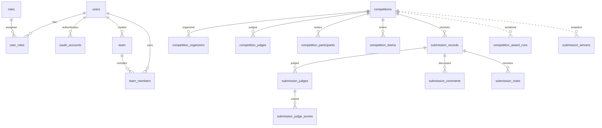

# Data, storage and event map

Updated 2026-10-04. Five domain services share `project_contest_platform`; service
ownership is a code convention. [V1](../../database/migrations/V1__existing_schema.sql)
has sixteen business tables; [V2](../../database/migrations/V2__durable_tasks_and_award_guards.sql)
adds three; [V3](../../database/migrations/V3__stable_oauth_accounts.sql) adds
stable OAuth bindings, for twenty business tables. Flyway also maintains its own
history table.

## Ownership

| Service | Primary tables | Deliberate shared reads |
| --- | --- | --- |
| user | users, roles, user_roles, oauth_accounts, team, team_members, notification_inbox | Durable work owned by user-service |
| competition | competitions, competition_organizers, competition_judges | Participant mapping, competition_award_runs lifecycle lock |
| registration | competition_participants, competition_teams, submission_records | Organizer mapping, current Competition status/deadline and award lock |
| interaction | submission_comments, submission_votes | Submission information via Feign |
| judge | submission_judges, submission_judge_scores, submission_winners, competition_award_runs | Valid Judge role/assignment and absence of Organizer overlap |
| common recovery | durable_tasks | Each service polls only its own owner value |
| file | MinIO buckets and keys | No SQL datasource |
| gateway | Redis session/token state | No domain SQL |

## Relationships and constraints

Existing SQL includes cross-domain foreign keys/cascades. Winner and award-run links
are logical, not physical foreign keys. User-role SQL allows a composite assignment;
application account workflows retain one role. Entrant/submission and Judge/submission
unique keys reject duplicates. OAuth identity uses unique provider/subject and
user/provider pairs; verified email alone cannot link an existing account.
Source constraints are authoritative in V1/V2/V3 rather
than a copied count that can drift.

## Version and transaction semantics

| Storage | Meaning |
| --- | --- |
| submission_records.revision | Current file/work version; replacement increments and clears Review/total |
| submission_records.score_version | Monotonic projection version; stale or duplicate updates are ignored |
| submission_judges.submission_revision | Revision rated by that Judge |
| submission_judges.score_schema_version | 1 means validated 0–10; migration leaves legacy rows at 0 |
| submission_winners.total_score | Committed Winner score snapshot; legacy null means unavailable |
| competition_award_runs.awarded_at | Finalized-run authority even before remote status synchronization |
| competition_award_runs.score_version | Competition-owned ordering of score tasks |
| durable_tasks | owner/kind/aggregate version/payload, state/attempts, availability/lease and sanitized error |
| notification_inbox.event_id | User consumer deduplication identity |
| oauth_accounts.provider / subject | Stable external identity; no automatic email-based linking |

Lifecycle changes, upload/Review/delete/cancel, Score and awarding share the run
row lock. Current Competition reads use locking reads when a stale MySQL snapshot
could otherwise admit a write. Remote score projection conditionally requires
APPROVED, matching revision and greater version.
Upload rechecks the registration and locks the current owned Submission after
the run/Competition locks; Review and deletion also reload the locked Submission.
Pre-lock entities cannot overwrite a committed replacement/revision or clean up
the wrong file after deletion.

Account deletion locks the administrator role and target account before reading
history or the last-Admin count. Team deletion locks the caller account and Team
before checking registration/submission history in SQL. Avatar and profile writes
share the account lock; dedicated avatar field updates prevent lost replacements.
Deletion rejects retained history rather than relying on cascading foreign keys
or treating a failed remote lookup as an empty history.

Old object deletion is inserted with local success. Upload rollback records cleanup
in a new transaction; failure of that transaction requires reconciliation. Business
Notification and remote score/status synchronization are persisted before commit.
Rabbit confirmation, consumer inbox and email work complete later. There is no
distributed database/SMTP transaction and no exactly-once email claim.

## Objects, Redis and messaging

The submissions bucket is private, including policy cleanup on an existing bucket.
Other public media retains its intended policy. Competition media and avatars use
dedicated upload seams with transactional old-object deletion and rollback cleanup;
business profile/Competition updates cannot inject arbitrary object references.
Application streaming authorizes
current Submission access and parses only a flat known key from historical URLs.
The browser does not receive a token-bearing third-party object URL.

Redis holds login/latest-token/blacklist and password-reset state. Rabbit has the
existing three topic exchanges and seven payload families; topology and historical
wire IDs are in [common messaging](../../backend/common-lib/src/main/java/com/w16a/danish/common/messaging).
The durable worker confirms publication and user-service records inbox/email work.

## Migrations and operations

[database/pom.xml](../../database/pom.xml) and Compose use Flyway with clean and
automatic baseline disabled. A fresh environment applies V1/V2/V3 before services.
V1 seeds roles and no administrator. Existing volumes need a reviewed explicit
baseline and backup; old Admin credentials and ambiguous Sydney historical dates
are not automatically repaired.

V3 does not guess bindings for older email-only OAuth accounts. Their owners use
password reset; real provider subjects are stored only after provider verification.

[mysql-init/create_table.sql](../../mysql-init/create_table.sql) is a compatibility
bootstrap, no longer mounted as a migration mechanism. Existing AWARDED competitions
get finalized run rows; unknown old score scales remain excluded from new awarding.

The [runbook](../production-readiness-2026-10-04.md) covers old-object policy cutover,
backup/restore, DEAD replay and orphan reconciliation. Real MySQL/Rabbit/object-store
results require separate release evidence. No services, tests, builds or database
migrations were run for this delivery.
