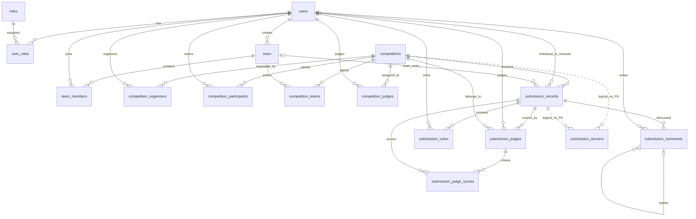
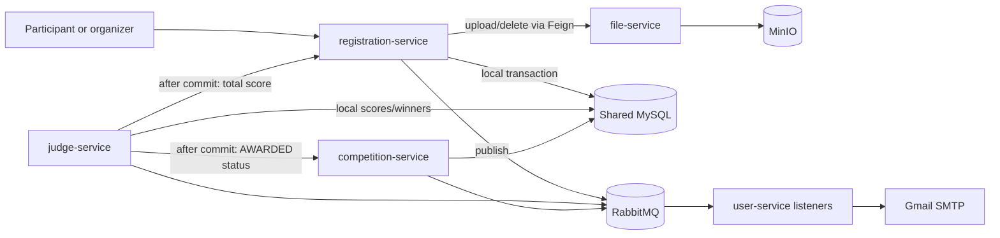

<!-- Audited: 2026-10-04 | Inventory: 16 tables, 19 PO classes, 19 Java mappers, 19 mapper XML files, 7 runtime configurations -->
# Data, Storage, and Event Map

This map follows the checked-out implementation. Schema/code observations are static evidence; no running MySQL, Redis, RabbitMQ, or MinIO instance was available during this audit. See [dependencies.md](dependencies.md) for deployment validation and [backend.md](backend.md) for API boundaries.

## Persistence boundary

Five services use **one shared MySQL database**, `project_contest_platform`, with the same configurable credentials. Service ownership is a code convention rather than database isolation. Registration and competition duplicate organizer/participant mappings; competition and judge duplicate the judge-assignment mapping.

| Service | Primary table ownership | Other direct table access | Configuration |
| --- | --- | --- | --- |
| user-service | `users`, `roles`, `user_roles`, `team`, `team_members` | — | [application.yml:7](../../backend/user-service/src/main/resources/application.yml#L7) |
| competition-service | `competitions`, `competition_organizers`, `competition_judges` | `competition_participants` | [application.yml:14](../../backend/competition-service/src/main/resources/application.yml#L14) |
| registration-service | `competition_participants`, `competition_teams`, `submission_records` | `competition_organizers` | [application.yml:14](../../backend/registration-service/src/main/resources/application.yml#L14) |
| interaction-service | `submission_comments`, `submission_votes` | Submission information through Feign | [application.yml:17](../../backend/interaction-service/src/main/resources/application.yml#L17) |
| judge-service | `submission_judges`, `submission_judge_scores`, `submission_winners` | `competition_judges`; submission/competition details through Feign | [application.yml:14](../../backend/judge-service/src/main/resources/application.yml#L14) |
| file-service | MinIO objects | JDBC/Redis/AMQP autoconfiguration excluded | [application.yml:4](../../backend/file-service/src/main/resources/application.yml#L4) |
| api-gateway | Redis token checks | No domain tables | [application.yml:14](../../backend/api-gateway/src/main/resources/application.yml#L14) |

All 19 Java mappers extend MyBatis-Plus `BaseMapper`. Their 19 XML files declare namespaces but contain no custom SQL. Query logic lives primarily in service implementations and Feign/gateway calls.

## Schema and relationships

[mysql-init/create_table.sql](../../mysql-init/create_table.sql) is mounted into MySQL's bootstrap directory by [Compose:9](../../docker-compose.yml#L9). It defines 16 InnoDB tables, 28 foreign keys, 10 named unique keys, 2 inline unique columns, and 23 explicitly declared secondary indexes. The database declaration uses `utf8`/`utf8_general_ci`; every table explicitly uses `utf8mb4`. No Flyway/Liquibase migration mechanism or backup/restore script was found in the tracked tree.

Dashed winner links are logical only: the actual winner table has **no foreign keys**.

| Table | Identity / uniqueness | Significant data and delete behavior | Schema |
| --- | --- | --- | --- |
| `users` | UUID string PK; unique email | bcrypt password field; profile and avatar URL | [12](../../mysql-init/create_table.sql#L12) |
| `roles` | Auto-increment integer PK; unique role name | ENUM Admin/Organizer/Participant/Judge | [24](../../mysql-init/create_table.sql#L24) |
| `user_roles` | Composite PK `(user_id, role_id)` | Both parents cascade | [33](../../mysql-init/create_table.sql#L33) |
| `team` | UUID PK | Creator deletion cascades to team | [50](../../mysql-init/create_table.sql#L50) |
| `team_members` | UUID PK; unique `(team_id, user_id)` | Team/user deletion cascades | [60](../../mysql-init/create_table.sql#L60) |
| `competitions` | UUID PK | Dates, visibility, status, participation ENUM; allowed types, criteria, image URLs are JSON | [74](../../mysql-init/create_table.sql#L74) |
| `competition_organizers` | UUID PK; unique `(competition_id, user_id)` | Competition/user deletion cascades | [93](../../mysql-init/create_table.sql#L93) |
| `competition_participants` | UUID PK; unique `(competition_id, user_id)` | Competition/user deletion cascades | [106](../../mysql-init/create_table.sql#L106) |
| `competition_teams` | UUID PK; unique `(competition_id, team_id)` | Competition/team deletion cascades | [119](../../mysql-init/create_table.sql#L119) |
| `competition_judges` | UUID PK; unique `(competition_id, user_id)` | Competition/user deletion cascades | [131](../../mysql-init/create_table.sql#L131) |
| `submission_records` | UUID PK; unique `(competition_id, user_id)` and `(competition_id, team_id)` | Review ENUM; total `DECIMAL(5,2)`; competition deletion cascades; user/team/reviewer deletion sets reference NULL | [144](../../mysql-init/create_table.sql#L144) |
| `submission_comments` | UUID PK | Submission/user/parent-comment deletion cascades | [172](../../mysql-init/create_table.sql#L172) |
| `submission_votes` | UUID PK; unique `(submission_id, user_id)` | Submission/user deletion cascades | [190](../../mysql-init/create_table.sql#L190) |
| `submission_judges` | UUID PK; unique `(submission_id, judge_id)` | `DECIMAL(5,2)` total; all parents cascade | [202](../../mysql-init/create_table.sql#L202) |
| `submission_judge_scores` | UUID PK | Criterion label, score and weight `DECIMAL(5,2)`; both parents cascade; no criterion uniqueness | [221](../../mysql-init/create_table.sql#L221) |
| `submission_winners` | UUID PK; unique `(competition_id, submission_id, award_name)` | Optional rank/description; no FK/cascade | [237](../../mysql-init/create_table.sql#L237) |

Most PO IDs use `ASSIGN_UUID`; roles use `AUTO`. [UserRoles:31](../../backend/user-service/src/main/java/com/w16a/danish/user/domain/po/UserRoles.java#L31) maps only `user_id` as its ORM ID despite the SQL composite PK. The application treats an account as having one role, while the schema permits multiple; generic ID operations need that distinction.

[Competitions:30](../../backend/competition-service/src/main/java/com/w16a/danish/competition/domain/po/Competitions.java#L30) enables Jackson handlers for three `List<String>` JSON fields. Criteria are string labels in Java; the SQL comment's example of weighted objects is not the runtime contract. [MyMetaObjectHandler:20](../../backend/common-lib/src/main/java/com/w16a/danish/common/config/MyMetaObjectHandler.java#L20) fills timestamps with JVM `LocalDateTime.now()`; SQL also supplies timestamp defaults. Datasource URLs use `serverTimezone=UTC`, while deadline logic uses local datetimes. The deployment time-zone convention needs explicit verification.

Bootstrap inserts four roles and a fixed administrator ([SQL:44](../../mysql-init/create_table.sql#L44), [SQL:249](../../mysql-init/create_table.sql#L249)). This is development seed data. Existing named MySQL volumes do not receive later bootstrap-schema edits automatically.

## Write and consistency flows

| Operation | Actual order / transaction boundary | Entry point |
| --- | --- | --- |
| Individual submission/replacement | Registration guard → competition read → upload → optional old-object delete → local write/reset review and score → user lookup → MQ publish. `@Transactional` covers local SQL only. | [SubmissionRecordsServiceImpl:124](../../backend/registration-service/src/main/java/com/w16a/danish/registration/service/impl/SubmissionRecordsServiceImpl.java#L124) |
| Team submission/replacement | Team/registration/creator guards → upload → optional old-object delete → local write → notification; same external-side-effect boundary. | [SubmissionRecordsServiceImpl:469](../../backend/registration-service/src/main/java/com/w16a/danish/registration/service/impl/SubmissionRecordsServiceImpl.java#L469) |
| Submission removal | Delete object first, then SQL row; FK cascades remove votes/comments/judge data, but cannot remove MinIO objects or winner rows. | [SubmissionRecordsServiceImpl:420](../../backend/registration-service/src/main/java/com/w16a/danish/registration/service/impl/SubmissionRecordsServiceImpl.java#L420) |
| Judge scoring | Local judge record + criteria → average → after-commit Feign write to submission total. | [SubmissionJudgesServiceImpl:410](../../backend/judge-service/src/main/java/com/w16a/danish/judge/service/impl/SubmissionJudgesServiceImpl.java#L410) |
| Auto-award | Read scored submissions → replace local winners → after-commit competition status update → winner events. | [SubmissionWinnersServiceImpl:256](../../backend/judge-service/src/main/java/com/w16a/danish/judge/service/impl/SubmissionWinnersServiceImpl.java#L256) |
| Competition removal | Remove organizer mappings/competition; SQL cascades handle dependent records. No object/winner cleanup in the method. | [CompetitionsServiceImpl:115](../../backend/competition-service/src/main/java/com/w16a/danish/competition/service/impl/CompetitionsServiceImpl.java#L115) |

After-commit callbacks prevent propagation of rolled-back local scores/winners, but do not make the remote write durable. A remote failure can leave committed scores with stale submission totals, or committed winners with an unchanged competition status. No persisted retry/outbox was found.

## MinIO objects

[BucketType:16](../../backend/file-service/src/main/java/com/w16a/danish/fileService/enums/BucketType.java#L16) defines `user-avatar`, `competition-assets`, and `submissions`; all have `publicRead=true`. [FileStorageServiceImpl:111](../../backend/file-service/src/main/java/com/w16a/danish/fileService/service/impl/FileStorageServiceImpl.java#L111) gives every newly created bucket anonymous `s3:GetObject`, without consulting the flag. It does not reconcile an existing bucket's policy.

Uploads use a UUID plus a sanitized extension, preserve client MIME type, and return a direct URL for **all** buckets ([implementation:65](../../backend/file-service/src/main/java/com/w16a/danish/fileService/service/impl/FileStorageServiceImpl.java#L65)). The default public host is `http://localhost:9000` ([configuration:28](../../backend/file-service/src/main/resources/application.yml#L28)); absolute URLs are stored in MySQL. There is no presigned-download implementation despite comments about private submissions and temporary URLs.

Avatars validate declared MIME/extension; promos/submissions only reject empty files ([FileValidator:15](../../backend/file-service/src/main/java/com/w16a/danish/fileService/util/FileValidator.java#L15)). The generic delete endpoint accepts arbitrary bucket/object names without caller-ownership checks ([FileUploadController:44](../../backend/file-service/src/main/java/com/w16a/danish/fileService/controller/FileUploadController.java#L44)); gateway authentication does not establish ownership.

## Redis and RabbitMQ

Redis's implemented scope is narrow:

| Key/state | Writer | Reader / expiry |
| --- | --- | --- |
| `jwt:token:{userId}` | [user JwtUtil:35](../../backend/user-service/src/main/java/com/w16a/danish/user/util/JwtUtil.java#L35) | [gateway JwtUtil:56](../../backend/api-gateway/src/main/java/com/w16a/danish/gateway/util/JwtUtil.java#L56); configured JWT TTL, normally 24 hours |
| `jwt:blacklist:{rawToken}` | [user JwtUtil:46](../../backend/user-service/src/main/java/com/w16a/danish/user/util/JwtUtil.java#L46) | Gateway blacklist check; caller-supplied TTL |
| `reset:token:{uuid}` | [UsersServiceImpl:370](../../backend/user-service/src/main/java/com/w16a/danish/user/service/impl/UsersServiceImpl.java#L370) | Reset flow reads then deletes; 15-minute TTL |
| OAuth state nonce | Servlet `HttpSession`, not Redis | [UsersController:268](../../backend/user-service/src/main/java/com/w16a/danish/user/controller/UsersController.java#L268); no Spring Session Redis integration found |

The gateway accepts an otherwise valid token when the latest-token key is missing; losing Redis session/blacklist state affects enforcement without invalidating every signed JWT. Connectivity exceptions fail verification. Reset-token read/delete is not atomic across concurrent requests.

Active RabbitMQ contracts are service-local; the `common-lib/MessagingConstants` class is unused:

| Producer / exchange | Routing key → durable queue | User-service consumer |
| --- | --- | --- |
| competition / `competition.topic` | `judge.assigned` → `judge_assigned_queue`; `judge.removed` → `judge_removed_queue` | `CompetitionJudgeEventListener` |
| registration / `registration.topic` | `register.success` → `register_success_queue`; `register.removed` → `participant_removed_queue`; `submission.uploaded` → `submission_uploaded_queue`; `submission.reviewed` → `submission_reviewed_queue` | `RegistrationEventListener` |
| judge / `judge.topic` | `award.winner` → `award_winner_queue` | `AwardWinnerEventListener` |

Sources: [competition config:21](../../backend/competition-service/src/main/java/com/w16a/danish/competition/config/CompetitionRabbitMQConfig.java#L21), [registration config:20](../../backend/registration-service/src/main/java/com/w16a/danish/registration/config/RabbitMQConfig.java#L20), [judge config:21](../../backend/judge-service/src/main/java/com/w16a/danish/judge/config/JudgeRabbitMQConfig.java#L21), [user queues:21](../../backend/user-service/src/main/java/com/w16a/danish/user/config/RabbitMQConfig.java#L21). JSON messages use persistent delivery mode; listeners auto-ack and send SMTP mail. No publisher confirms/mandatory returns, dead-letter policy, bounded listener retry, or consumer deduplication is configured.

Contrary to the blanket claim in `CONTEXT.md`, a publish failure can fail a request: [SubmissionNotifier:25](../../backend/registration-service/src/main/java/com/w16a/danish/registration/notify/SubmissionNotifier.java#L25) calls `convertAndSend` without catching the error, and upload/review call it inside SQL transactions. Successful publication does not prove SQL commit or email delivery.

## Audit implications and verification limits

| Concern | Static evidence / consequence | Needed runtime evidence |
| --- | --- | --- |
| Submission confidentiality | New submission buckets are public-read; an obtained object URL bypasses application guards. | Deployed bucket policy and anonymous GET; existing policy may differ. |
| Cross-system rollback | MinIO upload/delete precedes SQL commit; later failures can orphan new objects or leave SQL URLs pointing to deleted objects. | Inject DB/Feign/MQ failures and inspect both stores. |
| Winner orphans | No winner FK; competition/submission deletion leaves winner rows. | Actual MySQL cascade and post-delete query tests. |
| Database invariants | No CHECK for exactly one owner, ordered dates, score range, or duplicated submission/competition consistency; owner deletion can leave NULL-owner submissions. | MySQL constraint and concurrency tests. |
| Query scale | Relationship indexes exist; date/status/visibility and score sorting lack dedicated composite indexes. | Representative EXPLAIN plans; no measured performance failure is claimed. |
| Schema evolution/recovery | Bootstrap SQL only; no tracked migration or backup/restore workflow. | Upgrade populated volumes and demonstrate DB/object restore. |
| Infrastructure tests | No production-bootstrap-SQL test or MySQL Testcontainer reference; storage unit tests mock MinIO. | Browser → gateway → SQL/object/broker flows with real infrastructure. |

This audit did not execute SQL against MySQL or change stored data. Unit/slice tests do not establish MySQL FK/JSON/decimal behavior, real transaction callbacks, object privacy, mail delivery, or recovery correctness.
