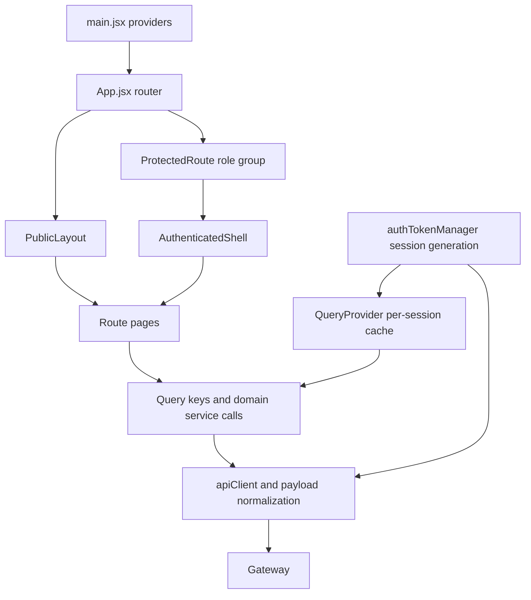

<!-- Source audit: 2026-10-04. Current validation is static only. -->
# Frontend code map

This map describes the current checkout. Read [CONTEXT](../../CONTEXT.md), [ADR-0001](../adr/0001-frontend-design-system.md), [ADR-0002](../adr/0002-react-query-data-layer.md), [ADR-0004](../adr/0004-session-lifetime-boundary.md), and [the scoring lifecycle decision](../adr/0006-scoring-and-competition-lifecycle.md) before changing a role journey. Historical passing checks do not establish that later source changes pass.

## Entry points and design

- [main.jsx](../../frontend/src/main.jsx): StrictMode, local fonts, ThemeProvider, QueryProvider, MotionConfig reducedMotion=user, and Toaster.
- [App.jsx](../../frontend/src/App.jsx): lazy route pages, public layout, protected role groups, error boundary and Suspense progress state.
- [AuthenticatedShell](../../frontend/src/layouts/AuthenticatedShell.jsx), [AppShell](../../frontend/src/layouts/AppShell.tsx), [Sidebar](../../frontend/src/layouts/Sidebar.tsx), and [Topbar](../../frontend/src/layouts/Topbar.tsx): one app shell. Sidebar collapses on desktop and uses Radix Sheet on mobile. Judge has a real role branch; collapsed links retain names/tooltips and 44px targets. The topbar has working browse/theme/account controls.
- [index.css](../../frontend/src/index.css): Indigo brand, slate neutrals, semantic feedback, light/dark variables, density and motion tokens. Inter is the UI font, Cal Sans the hero font, JetBrains Mono the score/ID font; icons remain Lucide. Secondary and muted foreground contrast values were corrected without changing the brand.
- [package.json](../../frontend/package.json) and [Vite config](../../frontend/vite.config.js): React 19, React Router 6, Vite, Tailwind 4, Radix, Axios, TanStack Query, Sonner, Framer Motion and Recharts. Node 24 LTS; dev port 3000; output build/.

## Actual routes

[App.jsx](../../frontend/src/App.jsx) is the route source; there is no parallel manifest. Email segments are navigation context, not authorization.

| Access | Paths | Main source |
|---|---|---|
| Public | /, /login, /reset-password, /oauth/callback, /how-to-use, /contest-list, /publiccontest-detail/:id, /work-list, /publicusercoments/:submissionId, /public-teams/:contestId, /public-team-detail/:competitionId/:teamId, /results/:competitionId, * | Homepages/, PublicUser/, pages/ |
| Participant | /profile/:email, /contest/:email, /teams/:email, /project/:email | Participant profile/contest/team/project |
| Judge | /judge, /judge/profile/:email; compatible /rating/:email, /JudgeSubmissions/:competitionId, /RatingDetail/:competitionId/:submissionId, /ReRating/:competitionId/:submissionId | Participant/Rating.jsx and JudgeSubmissions.jsx; Judge/ScoreSubmission.jsx |
| Authenticated, backend owns object access | /contest-detail/:id, /view-submission/:competitionId, /comments/:submissionId, /team-project-detail/:competitionId/team/:teamId, /project-detail/:competitionId | Participant subpages |
| Organizer | /OrganizerProfile/:email, /OrganizerDashboard/:email, /OrganizerContestList/:email, /OrganizerContest/:email, /OrganizerEditContest/:email, /OrganizerUploadMedia/:id, /OrganizerParticipantList/:competitionId, /OrganizerSubmissions/:competitionId, /submissions/:competitionId/ratings, /OrganizerAddJudge/:competitionId | Organizer/ |
| Admin | /AdminProfile, /AdminAccountManage, /AllCompetitions, /AdminDashboard | Admin/ |

[ProtectedRoute](../../frontend/src/components/ProtectedRoute.jsx) checks authentication and case-insensitive roles. Participant cannot score through old Judge URLs. The shell reads AuthContext; downstream object authorization is server-owned. Public signup allows Participant/Organizer; Judge/Admin are sign-in choices and privileged accounts require Admin provisioning.

## Main journeys and source ownership

| Journey | Source | Contract and behavior |
|---|---|---|
| Sign-in/signup/OAuth | [Login](../../frontend/src/Homepages/Login.jsx), [RegisterModal](../../frontend/src/Homepages/RegisterModal.jsx), [userService](../../frontend/src/services/userService.ts), [OAuthCallback](../../frontend/src/pages/OAuthCallback.jsx) | Roles normalize to uppercase for writes and navigation; public signup/OAuth permits Participant/Organizer and privileged roles require password sign-in. Callback prioritizes fragment error before token/query, clears the URL before paint and consumes once. Failed OAuth creates no session and replaces /login with a persistent business error and password/reset guidance. Successful fragment and legacy query callbacks remain compatible. No business UI writes auth localStorage. |
| Profile/session | [useProfileEditor](../../frontend/src/shared/hooks/useProfileEditor.js) | Shared by Admin, Organizer, Participant and Judge profile views. Avatar writes use the upload endpoint; profile updates omit avatarUrl. A successful password change clears the session and replaces the route with /login with a clear sign-in-again notice. |
| Homepage | [TopValues](../../frontend/src/Homepages/TopValues.jsx), [ContestCard](../../frontend/src/Homepages/ContestCard.jsx) | GET /competitions/list?page=1&size=4 returns PageResponse. Real IDs link to details; loading/error/retry/empty states. The old public/all API returns an array and is not used for homepage pagination. |
| Public catalogue | [UserContestList](../../frontend/src/PublicUser/UserContestList.jsx), [WorkList](../../frontend/src/PublicUser/WorkList.jsx), [TeamListPage](../../frontend/src/PublicUser/TeamListPage.jsx) | Server pagination and totals. Page/keyword/status/category/type filters live in the URL and restore on browser back. Works use approved submissions, actual vote mutation and comment links. |
| Public vs managed details | [competitionService](../../frontend/src/services/competitionService.ts), [queryKeys](../../frontend/src/api/queryKeys.js) | getById: public /competitions/{id}. getManagedById: authenticated /competitions/managed/{id}. Cache entries are distinct. Organizer/Admin/Judge/Participant private metadata uses the managed endpoint and backend ACL. |
| Individual work | [Project](../../frontend/src/Participant/project/Project.jsx), [Projectdetail](../../frontend/src/Participant/project/Projectdetail.jsx), [Submitbottom](../../frontend/src/Participant/project/Submitbottom.jsx) | Registration then upload; backend owns status/deadline/revision. File replacement requires a fresh review and score. |
| Team work | [TeamPage](../../frontend/src/Participant/team/TeamPage.jsx), [TeamProjectDetail](../../frontend/src/Participant/team/TeamProjectDetail.jsx), [registrationService](../../frontend/src/services/registrationService.js) | Own team submission uses protected GET /submissions/teams/{competitionId}/{teamId}, not the anonymous approved-only endpoint. |
| Managed team roster | [ParticipantList](../../frontend/src/Organizer/ParticipantList.jsx) | GET /registrations/teams/list includes authorized private contests and uses a distinct managedTeams cache entry. Actual competition.participationType selects the team view; TeamInfoVO.teamId/teamName supply row labels and removal IDs. Public TeamListPage keeps the public-only roster endpoint. Query and deletion errors remain visible. |
| Competition lifecycle | [Contest](../../frontend/src/Organizer/Contest.jsx), [ContestList](../../frontend/src/Organizer/ContestList.jsx), [EditContest](../../frontend/src/Organizer/EditContest.jsx) | Create UPCOMING; confirm explicit Start/End actions. Backend state drives actions. Criteria/type/dates freeze after opening; AWARDED/CANCELED editing is disabled. Organizer listing uses real server filters and pagination. |
| Admission review | [CheckSubmissions](../../frontend/src/Organizer/CheckSubmissions.jsx) | Review writes only in ONGOING; pending prevents duplicate submission/dismissal, comments max 2000, server errors stay visible and entered values remain. Existing decisions/files are readable after ending. |
| Judge assignment | [OrganizerAddJudge](../../frontend/src/Organizer/OrganizerAddJudge.jsx) | Direct assign-judges API validates actual Judge accounts. No incomplete Participant precheck or size=10000 request. Email deduplication/validation, pending/finalized guards, server paging, inline errors/retry and removal confirmation. |
| Judge queue | [Rating](../../frontend/src/Participant/Rating.jsx), [JudgeSubmissions](../../frontend/src/Participant/JudgeSubmissions.jsx) | Assigned competitions page in groups of 10. COMPLETED scoring and AWARDED reading; named scroll regions and detail loading/error/retry states. |
| Scoring | [ScoreSubmission](../../frontend/src/Judge/ScoreSubmission.jsx), wrappers [RatingDetail](../../frontend/src/Participant/RatingDetail.jsx) / [ReRating](../../frontend/src/Participant/ReRating.jsx) | One labelled 0–10 form. Authoritative context supplies file, criteria, canScore, revision and requiresRescore. Old scores are not relabelled /10. Failed saves preserve input; failed readback retries GET without repeating the stored write. Backend computes equal weights. |
| Award eligibility/results | [SubmissionRatings](../../frontend/src/Organizer/SubmissionRatings.jsx), [Results](../../frontend/src/PublicUser/Results.jsx), [judgeService](../../frontend/src/services/judgeService.js) | Every approved work needs 3 valid assigned Judges. Eligibility/blockers and canAward come from server; zero judges is unscored. Mobile readiness cards show blockers directly, desktop table is keyboard-scrollable. Managed finalized awards use GET /winners/list; public results use /winners/public-list. Public sharing requires eligibility.isPublic===true. |
| Media | [UploadMedia](../../frontend/src/Organizer/UploadMedia.jsx) | Authenticated details; writes only in UPCOMING/ONGOING. Pending controls, labelled file input and error/retry. Sequential partial upload removes already successful files from retry input; preview object URLs are released. |
| Organizer statistics | [Dashboard](../../frontend/src/Organizer/Dashboard.jsx) | Server page/total and URL page, 10 competitions per page. Metrics/status distribution explicitly cover the current page; named trends cover the selected competition. Metadata comes from the list; at most 1 list + 10 authenticated GET /dashboard/statistics calls per page. Private competitions use server ownership checks and internal aggregates. Failure blocks incomplete totals and offers retry. |
| Admin Judge provisioning | [AdminAccountManage](../../frontend/src/Admin/AdminAccountManage.jsx) | POST /users/admin/accounts creates role JUDGE. Returned account data never replaces Admin auth session. Labelled pending/error form; backend retained-history deletion conflicts stay visible. |
| Admin competition management | [AdminCompetitionsManage](../../frontend/src/Admin/AdminCompetitionsManage.jsx) | Protected GET /competitions/admin/list includes private contests and uses a separate adminList cache key. Managed detail access, filter/paging totals, loading/error/retry, and visible deletion conflicts. Deletion is offered only for UPCOMING/CANCELED. |

## Shared boundaries

[authTokenManager](../../frontend/src/auth/authTokenManager.js), [AuthContext](../../frontend/src/context/AuthContext.jsx), [QueryProvider](../../frontend/src/providers/QueryProvider.jsx), [apiClient](../../frontend/src/api/apiClient.js), [queryFn](../../frontend/src/api/queryFn.js), and [serviceUtils](../../frontend/src/services/serviceUtils.js) own session lifetime, cache isolation, captured request identity, stale-response rejection and Axios/bare/enveloped payload normalization. Business pages should use these seams rather than add independent session or response logic.

apiClient preserves AxiosResponse and the raw controller body in response.data; queryFn/serviceUtils perform the separate unwrapping step. [types](../../frontend/src/types/index.ts), [request types](../../frontend/src/types/api.ts), [competitionService](../../frontend/src/services/competitionService.ts), and [userService](../../frontend/src/services/userService.ts) distinguish bare VO/PageResponse/boolean/auth bodies from the actual ApiResponse<string> mutation messages. AuthSession uses accessToken/name/expiresIn; profile fields and nullable redacted user contacts follow the current VOs. Public roles, profile/avatar separation, team requests and criterion/score DTOs follow their controller contracts.

[fileService](../../frontend/src/services/fileService.js) and [SubmissionFile](../../frontend/src/shared/components/SubmissionFile.jsx) download Blobs through the gateway with the active session. Only same-origin /submissions/{id}/download or /submissions/public/{id}/download paths are accepted, without query/fragment. Storage URLs and external hosts do not receive credentials. Object URLs are revoked after download; no token query strings or private window.open links.

Actual shared UI: [PageError](../../frontend/src/shared/components/PageError.jsx), [PageSkeleton](../../frontend/src/shared/components/PageSkeleton.jsx), [EmptyState](../../frontend/src/shared/components/EmptyState.jsx), [Pagination](../../frontend/src/shared/components/Pagination.jsx), [ConfirmDialog](../../frontend/src/shared/components/ConfirmDialog.jsx), and [usePagedSearchParams](../../frontend/src/shared/hooks/usePagedSearchParams.js). [competitionCategories](../../frontend/src/shared/competitionCategories.js) shares the same taxonomy across create/edit/browse; [dateTime](../../frontend/src/lib/dateTime.js) treats backend ISO strings without Z as UTC and converts scheduling inputs back to UTC.

Unused duplicate public cards/tables were removed. Superseded public/all, scored-list, public per-competition dashboard and internal-only status frontend service wrappers were removed after checking references. Earlier cleanup and session evidence lives in [the architecture cleanup record](../architecture-cleanup-2026-10-04.md).

## Verification scope

The latest instruction prohibits tests, builds, service startup, browser execution and deployment. Current validation is source parsing, local import resolution, controller-path comparison, diff whitespace and explicitly permitted tsc --noEmit static type checking. The parser checks JS/JSX/TS/TSX, including test source, without running application code. Type checking follows the existing tsconfig (allowJs=true, checkJs=false); it does not check JavaScript behavior. HTTP shape comparison establishes verb/path existence, not authorization, payload fields or live behavior.

The final static snapshot parsed 124 production src files plus 41 test/helper files (165 total) and resolved 650 production local imports / 770 total local imports without failures; 89 service HTTP calls matched 145 controller verb/path shapes. All 8 browser-test source files parsed without execution, all 82 map file references existed, and git diff --check reported no whitespace errors. The separate tsc --noEmit check exited 0; its log is .git/audit/2026-10-04/frontend-static-types.log. These counts and static checks do not establish runtime behavior.

Existing test sources include [session lifetime](../../frontend/src/auth/__tests__/sessionLifecycle.test.jsx), [OAuth callback](../../frontend/src/Tests/OAuthCallback.test.jsx), [paged Organizer statistics](../../frontend/src/Tests/Organizertests/OrganizerDashboard.test.js), [service paths](../../frontend/src/Tests/serviceRoutes.test.js), [score flow](../../frontend/src/Tests/Participanttests/RatingFlow.test.jsx), [Organizer readiness](../../frontend/src/Tests/Organizertests/SubmissionRatings.test.js), [public journeys](../../frontend/src/Tests/PublicUsertests/ReadinessJourneys.test.jsx), and [readiness browser journeys](../../frontend/e2e/readiness-journeys.spec.js). Browser source covers Judge/Organizer populated views at 375/768/1440, light/dark, reduced motion, keyboard sheet/collapse, score persistence, threshold blockers, public/managed results, URL paging and Admin session preservation. Most browser business APIs are fixtures; this is not real gateway/database/MinIO/OAuth evidence. Newly synchronized callback/paging source has not been executed.

Historical gates before the last contract/static changes: 39 Jest suites / 210 tests and 53 Chromium cases passed. A subsequent 211-test run recorded 209 passed / 2 failed due to updated managed detail contracts; corresponding fixture/cache expectations are now corrected in source but not rerun. The later 54-case browser run was interrupted and supplies no complete final pass. Historical tsc/build successes likewise predate the latest edits. Current raw static evidence is .git/audit/2026-10-04/frontend-static-review.log; older logs/screenshots remain local audit artifacts.

[scripts/integration-smoke.mjs](../../scripts/integration-smoke.mjs) is a real-API verification script owned by the root task; its existence or syntax check does not imply it was run. No current deployment, external OAuth/SMTP credentials, live data journey, whole-project WCAG certification, or current runtime test success is asserted here. Generated build/, coverage, test-results/ and playwright-report/ remain untracked.

## Remaining limits

- Organizer dashboard intentionally offers current-page metrics and selected-competition trends; a true all-competitions aggregate would need a backend endpoint rather than summing an incomplete page.
- Recharts accessibility, all route/layout combinations and external authentication need runtime review when the user authorizes it.
