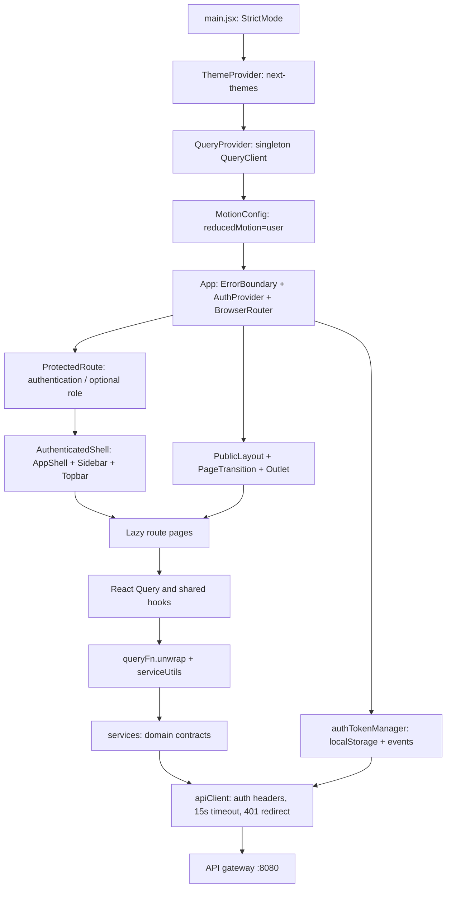

<!-- Verified scan: 2026-10-04 -->
# Frontend code map

This map describes the checked-out implementation, including incomplete paths. Read [CONTEXT.md](../../CONTEXT.md) for vocabulary, [ADR-0001](../adr/0001-frontend-design-system.md) for UI decisions, and [ADR-0002](../adr/0002-react-query-data-layer.md) for data decisions. Historical phase checkmarks are not proof that a role journey works today.

## Inventory and entry points

| Item | Verified count / implementation |
|---|---|
| Files below `frontend/src` | 180: 104 JSX, 45 JS, 20 TSX, 6 TS, 2 CSS, 2 JPG, 1 JSON |
| Production JS/JSX/TS/TSX files | 138, excluding Jest files |
| Routes / lazy imports | 39 explicit paths including `*` / 39 lazy imports |
| Domain HTTP service files | 6, plus `index.js` and `serviceUtils.js` |
| Service HTTP calls | 85; every literal call matches a backend verb and path shape |
| React Query source files | 41 containing `useQuery`, `useQueries` or `useMutation` |
| Shared / UI primitive files | 16 / 15 |
| Jest / Playwright files | 35 / 7 |

Versions and commands live in [package.json](../../frontend/package.json) and [package-lock.json](../../frontend/package-lock.json). The stack is React 19, Vite, React Router 6, Tailwind 4, Radix, Axios, TanStack Query, Sonner, Framer Motion and Recharts. The shell/primitives and two service modules use TypeScript; most business UI is JavaScript. MUI, TanStack Table and react-day-picker are not dependencies in this checkout.

- [main.jsx](../../frontend/src/main.jsx): providers, local font imports, global motion policy and Toaster.
- [App.jsx](../../frontend/src/App.jsx): actual router and authorization groups; Suspense uses a named progressbar.
- [vite.config.js](../../frontend/vite.config.js): port 3000, `@` alias, `/api` development proxy, `build/` output and vendor chunk.
- [index.html](../../frontend/index.html): real Vite entry, viewport and metadata; `public/index.html` is not the Vite entry.

## Actual route map

`App.jsx` owns the router. [routeManifest.js](../../frontend/src/routes/routeManifest.js) mirrors paths but is not consumed by the router, sidebar or current business pages; [useRoute.js](../../frontend/src/routes/useRoute.js) has no production callers. In the manifest, `roles: []` describes both public and authenticated-without-role-restriction groups, so it cannot independently describe access requirements.

| Access group | Paths | Ownership |
|---|---|---|
| Public (12 including fallback) | `/`, `/login`, `/reset-password`, `/oauth/callback`, `/how-to-use`, `/contest-list`, `/publiccontest-detail/:id`, `/work-list`, `/publicusercoments/:submissionId`, `/public-teams/:contestId`, `/public-team-detail/:competitionId/:teamId`, `*` | `Homepages/`, `PublicUser/`, `pages/` |
| Participant only (5) | `/profile/:email`, `/contest/:email`, `/teams/:email`, `/project/:email`, `/rating/:email` | `Participant/profile`, `contest`, `team`, `project`, `Rating.jsx` |
| Any authenticated account (8) | `/contest-detail/:id`, `/JudgeSubmissions/:competitionId`, `/RatingDetail/:competitionId/:submissionId`, `/ReRating/:competitionId/:submissionId`, `/view-submission/:competitionId`, `/comments/:submissionId`, `/team-project-detail/:competitionId/team/:teamId`, `/project-detail/:competitionId` | `Participant/` |
| Organizer only (10) | `/OrganizerProfile/:email`, `/OrganizerDashboard/:email`, `/OrganizerContestList/:email`, `/OrganizerContest/:email`, `/OrganizerEditContest/:email`, `/OrganizerUploadMedia/:id`, `/OrganizerParticipantList/:competitionId`, `/OrganizerSubmissions/:competitionId`, `/submissions/:competitionId/ratings`, `/OrganizerAddJudge/:competitionId` | `Organizer/` |
| Admin only (4) | `/AdminProfile`, `/AdminAccountManage`, `/AllCompetitions`, `/AdminDashboard` | `Admin/` |

The `:email` segments are navigation context, not authentication. Identity comes from session/API headers. The organizer edit route retains its historical email parameter while competition identity comes from the `?competitionId=` query parameter (`EditContest.jsx:72-74`, `ContestList.jsx:126-127`).

[ProtectedRoute](../../frontend/src/components/ProtectedRoute.jsx) sends missing sessions to `/login` with return-location state and role failures to `/`; role checks are case-insensitive. [AuthenticatedShell](../../frontend/src/layouts/AuthenticatedShell.jsx) reads AuthContext, not the URL.

[Sidebar.tsx](../../frontend/src/layouts/Sidebar.tsx) provides Home and Browse Contests for every role, then adds Participant Profile/Competitions/Teams/Submissions/Scoring Queue, Organizer Profile/Dashboard/Competitions/Create, or Admin Dashboard/Accounts/Competitions/Profile. There is no Judge role branch. Desktop navigation collapses; mobile navigation uses a Radix Sheet. [Topbar.tsx](../../frontend/src/layouts/Topbar.tsx) has theme/account controls, an optional search callback that AppShell does not supply, and a notification button with no action.

## Feature ownership and API seams

| Journey | Main source | Service / backend ownership |
|---|---|---|
| Sign in, register, reset, OAuth callback | `Homepages/Login.jsx`, `RegisterModal.jsx`, `RoleSelectModal.jsx`, `pages/ResetPassword.jsx`, `OAuthCallback.jsx` | `userService.ts` / `UsersController` |
| Public competition catalogue/detail | `PublicUser/UserContestList.jsx`, `PublicContestDetail.jsx`, `UserContestCard.jsx`, public list/table components | `competitionService.ts` / `CompetitionsController` |
| Approved works, votes and comments | `PublicUser/WorkList.jsx`, `ComentsPage.jsx`; `Participant/contest/ViewSubmission.jsx`, `CommentsPage.jsx`; `Participant/ViewVote.jsx` | submission, vote and comment services / registration-service + interaction-service |
| Participant registration/withdrawal | `Participant/contest/ContestCard.jsx`, `ChangeContestList.jsx`, `ContestDetail.jsx` | `registrationService` / `CompetitionParticipantsController` |
| Individual submission lifecycle | `Participant/project/Project.jsx`, `Projectdetail.jsx`, `Submitbottom.jsx` | `submissionService` / `SubmissionRecordsController` |
| Teams, membership, team submission | `Participant/team/TeamPage.jsx`, `ParticipantTeam.jsx`, dialogs, `TeamRegistrations.jsx`, `TeamProjectDetail.jsx`; public team pages | team, registration and submission services / user-service + registration-service |
| Organizer competition lifecycle/media | `Organizer/Contest.jsx`, `ContestList.jsx`, `EditContest.jsx`, `UploadMedia.jsx` | competition-service; file-service uploads through backend delegation |
| Organizer removal/admissibility review | `Organizer/ParticipantList.jsx`, `CheckSubmissions.jsx` | registration/submission services |
| Judge assignment/removal | `Organizer/OrganizerAddJudge.jsx` | competition service assignment/list/removal; assignment uses emails |
| Judge score/revision | `Participant/Rating.jsx`, `JudgeSubmissions.jsx`, `RatingDetail.jsx`, `ReRating.jsx` | `judgeService` / `SubmissionJudgesController` |
| Score comparison/auto-award | `Organizer/SubmissionRatings.jsx` | `winnerService` / `SubmissionWinnersController` |
| Organizer/platform dashboards | `Organizer/Dashboard.jsx`, `Admin/AdminDashboard.jsx` | `dashboardService` / `DashboardController` |
| Admin accounts/competitions | `Admin/AdminAccountManage.jsx`, `AdminCompetitionsManage.jsx` | user/competition services |

### Endpoint modules

| Source | Literal HTTP calls | Controller routes |
|---|---:|---|
| [userService.ts](../../frontend/src/services/userService.ts) | 13, plus two OAuth URL builders | `/users` |
| [teamService.js](../../frontend/src/services/teamService.js) | 15 | `/teams` |
| [competitionService.ts](../../frontend/src/services/competitionService.ts) | 16 | `/competitions` |
| [registrationService.js](../../frontend/src/services/registrationService.js) | 22 across registration/submission exports | `/registrations`, `/submissions` |
| [interactionService.js](../../frontend/src/services/interactionService.js) | 8 across comments/votes | `/interactions` |
| [judgeService.js](../../frontend/src/services/judgeService.js) | 11 across judging/winners/dashboards | `/judges`, `/winners`, `/dashboard` |

[serviceRoutes.test.js](../../frontend/src/Tests/serviceRoutes.test.js) reads Java controllers and compares HTTP verb plus normalized path: IDs become wildcards and query strings are removed. The successful scan compared 85 service calls against 114 distinct backend endpoint shapes. It establishes path existence, not payload fields, response schema, authorization or URL builders. Five HTTP call sites bypass domain modules: Login's sign-in/forgot password, RegisterModal's registration, and homepage ContestCard's vote/join.

[unwrapApiPayload](../../frontend/src/services/serviceUtils.js) and [queryFn.unwrap](../../frontend/src/api/queryFn.js) handle Axios responses containing `ApiResponse`, paginated `PageResponse` and historical raw objects/arrays/scalars. Login/registration actually return raw `UserResponseVO` with `accessToken`, which their forms read directly. Vote count/status are raw number/boolean. TS annotations are not reliable evidence of the live payload schema.

### Judge capabilities: present and incomplete

- Assigned competition queue exists in `Rating.jsx`, including a competition-detail dialog; Review is enabled only for `COMPLETED`.
- `JudgeSubmissions.jsx` lists approved entries, marks previously scored items, opens judging detail, and links to first score/revision.
- `RatingDetail.jsx` has 0-10 criterion sliders with step 0.1, initial score 5, equal weights `1 / criteria.length`, feedback and POST `/judges/score`.
- `ReRating.jsx` seeds previous scores/weights/feedback and PUTs `/judges/{id}`.
- There is no separate `Judge/` module, Judge dashboard/profile or Judge-specific navigation/login selection. The queue URL only admits Participant accounts. An assigned Participant can use this journey; a distinct Judge-role account cannot reach that queue normally.
- Organizer comparison and automatic awarding have pages. The published-winner API `/winners/public-list` has a service method but no production caller or public winner page. There is no manual winner override.

## Server state, sessions and shared modules

[QueryProvider](../../frontend/src/providers/QueryProvider.jsx) creates one module-level client: default staleTime 30 seconds, garbage collection 15 minutes, focus/reconnect refetch, at most two retries for transient failures, no retries for 400/401/403/404/409/422 or mutations. Named tiers in [queryKeys.js](../../frontend/src/api/queryKeys.js) are live 0, short 30 seconds, medium 5 minutes and long 15 minutes. Domain prefixes support invalidation; some feature suffixes are composed at call sites.

- [useProfileEditor](../../frontend/src/shared/hooks/useProfileEditor.js) owns profile query, guarded form seeding, profile/avatar writes and account deletion for three roles. It validates image MIME/5 MiB, sanitizes filenames, and revokes preview URLs.
- [useCommentThread](../../frontend/src/shared/hooks/useCommentThread.js) owns pagination, posting/replies, editing/deletion and thread invalidation. Posting optimistically patches page 1 and rolls back failures.
- [ViewVote](../../frontend/src/Participant/ViewVote.jsx) shares count/status caches, cancels reads before optimistic toggles, rolls back errors and invalidates on settlement.
- Registration/withdrawal and team membership use optimistic state; account/competition list deletions also use optimistic removal. Other writes usually invalidate/refetch.
- `useQueries` parallelizes WorkList vote tallies, organizer reporting, Project/TeamRegistrations submission enrichment and MyTeamsDialog creator details. These are cached fan-outs; request count still grows with list size.
- Active shared reuse includes comment components, ConfirmDialog, EmptyState, PageSkeleton, root ErrorBoundary, and user/team form schemas.

[authTokenManager](../../frontend/src/auth/authTokenManager.js) alone reads/writes auth storage keys `token`, `userId`, `email`, `role`; it emits same-tab events and subscribes to cross-tab storage changes. [AuthContext](../../frontend/src/context/AuthContext.jsx) subscribes and exposes login/logout/user/token. [apiClient](../../frontend/src/api/apiClient.js) uses `VITE_API_BASE_URL` or `http://localhost:8080`, 15-second timeout, Bearer/identity headers and FormData-aware content type. HTTP 401 clears the session and performs a full redirect to `/login`.

## UI, accessibility and motion

[index.css](../../frontend/src/index.css) owns light/dark HSL tokens, Tailwind `@theme` bridges including semantic foreground pairs, global focus rings, skip links and reduced-motion reset. Local Inter and JetBrains Mono are active; Cal Sans from the historical ADR is not loaded by `main.jsx`. [ThemeProvider](../../frontend/src/providers/ThemeProvider.tsx) uses next-themes, class-based themes, `theme` storage and system preference by default.

Motion tokens are page 150 ms, card 200 ms and modal 180 ms. Semantic classes handle route fades, cards and Radix dialog/sheet/popover states. PageTransition retriggers a class without remounting the route subtree. Hero uses Framer Motion under root reducedMotion policy. Component-local `duration-*` classes still exist in sidebar/homepage cards, so not every duration is centralized.

Both layouts provide a skip link and `main#main`; authenticated main has `tabIndex=-1`. Radix supplies overlay/menu primitives. Native tables, selects and sliders remain in feature pages. Lazy route splitting and aspect-ratio covers exist; this source scan does not measure runtime image/font performance.

## Verified risks and incomplete contracts

These are concrete source observations, not fixes made by the mapping task. Passing unit tests does not resolve them.

| Finding | Evidence and consequence |
|---|---|
| Private cache survives account changes | `QueryProvider.jsx:46` creates one client; `queryKeys.js:34` profile and several mine/judge keys omit identity; `AuthContext.jsx:45-59` changes session only; `Topbar.tsx:40-43` uses client navigation. `useProfileEditor.js:43-60` accepts a fresh 15-minute cached profile and seeds once. A second account in the same SPA session can receive the first account's cached private values. Cache reset/user-scoped keys need acceptance coverage. |
| Homepage sample cards invoke live writes with synthetic IDs | `TopValues.jsx:14-58` hardcodes dated sample competitions and `:79-90` passes array index 0-3 as ID. `ContestCard.jsx:44-45` uses it as submissionId for voting and `:70` as competition ID for registration. Endpoint existence does not validate these entities. |
| Distinct Judge role has no queue entry | `App.jsx:107-113` makes `/rating/:email` Participant-only; `Sidebar.tsx:60-88` handles Participant/Organizer/Admin only; `RoleSelectModal.jsx:44-67` offers Participant/Organizer. Scoring subroutes merely require authentication. RatingFlow unit tests mount pages directly and do not prove app entry for Judge accounts. |
| OAuth buttons target frontend origin | `RegisterModal.jsx:357,369` goes to `/users/oauth/...` directly. API-origin builders in `userService.ts:61-65` are unused. `vite.config.js:16-22` only proxies `/api`, so Vite does not proxy these `/users` requests. Deployment must explicitly route them or buttons must use the API origin. |
| Browser logout skips server invalidation | `Topbar.tsx:40-43` / `AuthContext.jsx:55-58` clear local state without `userService.logout`. `UsersController.java:128-137` has a real JWT-blacklisting logout endpoint that this UI does not invoke. |
| Types drift from live schemas | `types/index.ts:11` declares ENDED/CANCELLED instead of COMPLETED/AWARDED/CANCELED; User uses username/bio instead of name/description; `types/api.ts:23-44` registration/profile fields differ from live forms; `userService.ts:13-24` declares token/enveloped sessions while login returns raw accessToken. `checkJs:false` leaves JS usage unvalidated by tsc. |
| Scoring accessibility/loading/error gaps | `RatingDetail.jsx:94-107,114-126` and `ReRating.jsx:99-112,119-131` Labels lack linked IDs; submit buttons remain enabled during mutations and query errors are not rendered. `JudgeSubmissions.jsx:187-205` icon pagination lacks accessible names; search is placeholder-only. Existing axe coverage omits these pages. |
| Keyboard gaps outside sampled pages | Collapsed Sidebar links remove visible text at `Sidebar.tsx:118` and rely on tooltip content; `SubmissionRatings.jsx:125-140` sorts using clickable th elements without keyboard handlers/buttons. Existing browser tests do not exercise those states. |
| Published winner display absent | `judgeService.js:41` defines getPublicList; no production consumer exists. Auto-award is present but public results are not a completed UI journey. |
| Pagination hides real records | `UserContestList.jsx:54-70,104-107` requests no page/size, then paginates only the returned slice; `CompetitionsController.java:112-115` defaults to 10 records. `WorkList.jsx:50-59` similarly requests only the first default 10 approved submissions and has no server pagination. `TeamRegistrations.jsx:41-46,62-69,215-217,308` initializes pages to 0, never copies pages from teamsPage, and only displays navigation when pages > 1; teams beyond its first 10 are unreachable. Fixtures contain one or two rows and do not catch these larger-list paths. |
| Homepage axe result depends on animation readiness | The single-worker public-page rerun captured one serious color-contrast rule on 12 HeroPreview text nodes (ratios 1.36-1.76). `Hero.jsx:201-204` animates their parent opacity over 0.7 seconds after 0.15 seconds; `a11y.spec.js:43-45` waits for networkidle rather than settled motion. A separate light-mode Chromium probe explicitly waited for parent opacity 1 and found zero violations. This identifies a timing gap in the test, not a proven persistent token-contrast failure. The checked-in E2E command still failed in this scan. |

The backend judging API permits completion or an end date in the past; `Rating.jsx:118` only enables Review for COMPLETED, potentially hiding permitted work. Score-page seed refs are not keyed by route IDs and PageTransition preserves the subtree, so same-component ID changes need a route-change test.

## Residual modules

Static relative-import traversal from `main.jsx` and caller searches found no production import of `useApiQuery`, `useAsync`, `useAuthToken`, `routeManifest/useRoute`, `useContestFiltering/ContestListView`, FormField, AsyncBoundary, primitives/StatusBadge, Homepages/Loading, Tours, PublicUser/WorkDetail, PublicUser/ContestDetail, old Participant AddComment/DeleteComment/ProjectComment, competitionSchema or services/index.js. Some are covered by tests or re-exported by unused barrels. Check callers before treating them as active seams. Active details are PublicContestDetail and Participant/contest/ContestDetail.

## Validation and coverage boundaries (2026-10-04)

| Check | Result |
|---|---|
| `npm test -- --runInBand` | Passed: 35 suites, 178 tests, 0 snapshots; 76.731 seconds |
| `npm run build` | Passed: Vite 8.1.5, 3,143 transformed modules; 2.83 seconds |
| Local `tsc --noEmit` | Passed, with checkJs:false |
| `playwright test --list` | 35 tests across 7 files |
| Chromium install | Passed; Playwright browser runtime downloaded into the existing machine cache, without project dependency changes |
| `npm run test:e2e` (8 workers) | Failed: 27 passed, 5 flaky, 3 failed; 3.7 minutes. Initial 8 timeouts; 3 retries then hit browser-launch timeout (180 seconds). No axe rule failure in this first run. |
| Public-page axe loop rerun (1 worker, retries 0) | 10 tests: 9 passed, 1 failed; 30.8 seconds. Original failed loop declarations regenerated all 10 light/dark public-page checks; Participant and keyboard tests were not repeated. Homepage failed color-contrast during its entrance animation. |
| Targeted settled homepage axe probe | Passed in light mode at 1280x720: preview opacity 1, zero WCAG A/AA violations; text color rgb(15,23,41). This diagnoses the failing check's readiness gap and does not change its recorded failure. |

Build chunks: index JS 166.80 kB (gzip 52.29), vendor 213.81 kB (68.07), Homepage 131.57 kB (42.66), chart chunk 381.06 kB (100.68). These are artifact sizes, not page-load measurement. No chunk-size warning was emitted; the build does not automatically run TypeScript or browser tests.

Jest covers role guards, session manager, query/adapters/cache isolation, endpoint existence, motion, empty/loading/error states, public pages and several Participant/Organizer/Admin workflows. Browser specs cover Participant comments, contests, profile, projects, rating queue and teams plus axe/keyboard checks. Axe samples five public pages in light/dark, one authenticated contest page, one dialog and keyboard landmarks; it does not scan all routes, roles, mobile layouts or scoring forms. Participant specs and authenticated axe paths stub selected APIs and seed auth locally. The public axe-page loop has no API stubs: with the backend unavailable, catalogue scans can inspect empty/error surfaces. Neither run proves real gateway/DB/OAuth/MinIO journeys or full populated-page accessibility.

Raw logs are local under `.git/scan-2026-10-04/`: frontend-jest.log, frontend-build.log, frontend-typescript.log, frontend-e2e-list.log, frontend-playwright-install.log, frontend-e2e.log, frontend-e2e-rerun.log and frontend-homepage-settled-axe.log. Generated build/, playwright-report/, test-results/ and coverage directories must remain untracked. No product source was changed by this scan.
