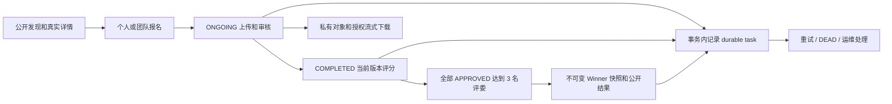

# Questora 前后端优化方案与发布验收

日期：2026-10-04。用户已确认全部采用推荐方案：面向真实小规模公开比赛，保留现有项目设计与服务边界；0–10 等权评分；每件已通过审核的作品至少三名不同的有效评委。本文记录实现与可重复验收，不把测试通过称为企业认证。

## 方案选择

| 选择 | 本项目采用的方案 | 原因及代价 |
| --- | --- | --- |
| 架构 | 保留七个 Spring 服务、共享 MySQL、已有 Feign seam | 延续业务设计；用明确事务和共享锁修复一致性。共享数据库和服务密钥仍是隔离边界限制 |
| UI | 保留 Indigo、Inter、Radix、Lucide 和已有明暗主题 | 围绕发现、提交、审核、评分、结果的任务链改进，不再引入第二套视觉体系 |
| 状态 | 服务端显式生命周期；截止时间独立关闭写入 | 避免浏览器日期推算与后端状态不同步；组织者须明确结束比赛才进入评分 |
| 评分 | 服务端校验 0–10、完整 criteria、等权均值与当前 revision | 避免可编辑权重、错赛评分和历史 0–100 值混入；未结束的旧比赛需要重新评分 |
| 评奖 | 所有 APPROVED 作品达到三名有效评委后一次生成快照 | 未评分作品也会阻止发奖；并列使用 1、1、3，重复操作不会重复生成结果 |
| 文件 | 私有 submissions bucket；应用授权后流式下载 | 上传者、团队、组织者、有效评委和公开 APPROVED 场景各自检查；历史对象需真实策略切换 |
| 恢复 | 同事务 durable task、Rabbit confirm、消费 inbox、邮件任务 | 远端故障可以重试和追踪；SMTP 在模糊成功时仍可能重复投递 |
| 演进 | Flyway V1/V2/V3，禁止自动 baseline/clean，取消默认 Admin | 新库可自动迁移；旧库必须先审核和备份，再显式 baseline；OAuth 使用真实 provider subject |
| 运行环境 | Java 25、Boot 4.1、配套 Cloud/Alibaba、Node 24 LTS | 避免继续使用旧维护线；Jackson 2 桥接保留既有协议，须在 Boot 4.3 前独立迁移 |

拆成独立服务数据库、引入工作流集群、全面重做设计系统，都会增加本项目当前规模的维护成本。后续只有在租户隔离、持续负载或多团队独立交付出现实证需求后，再重新评估这些选择。



## 已实现的界面及契约

- Judge 有独立入口、导航和评分工作台；Participant 不能进入评分路由。评分展示实际 Competition、作品 revision、criteria、审核和既有评分状态。
- 首页来自真实比赛列表并链接真实 ID。OAuth 请求使用 gateway origin；Participant/Organizer 使用绑定 provider 的一次性完整 state、稳定 subject 和已验证 email。已有同 email 本地账户不自动关联，Judge/Admin 保持密码登录；取消授权与恢复账户提示在登录页持续可见，回调 fragment 在绘制前清除。
- 比赛、作品、团队及组织者比赛列表使用服务端分页，筛选和页码写入 URL，总数来自服务器，浏览器回退可恢复条件。
- 组织者评奖页面显示每件 APPROVED 作品的 N/3、阻止原因及确认操作。移动端直接显示 readiness 卡片，桌面保留密集表格。
- 公开结果有稳定路由、排名和已提交快照。历史缺失分数显示 unavailable，避免显示为真实 0 分。
- 比赛开始/结束使用显式确认、等待和失败反馈。开始后锁定规则、类型与日期；统一解析 API 无 Z 的 UTC 时间。
- 管理员创建 Judge 的对话框调用管理员端点，保留原管理员会话；公开注册不能选择特权角色。
- 私有下载只向受验证的 gateway 路径携带会话，不把 Bearer 发给对象域名。改进浅色对比度、弹窗目标尺寸、折叠侧栏标签、键盘操作和 reduced motion。
- 组织者仪表盘每页十场比赛，保留 URL 页码、服务器总数和当前范围；汇总明确属于当前页，趋势明确属于选中比赛，避免将第一页误称为全部数据及无上限请求。
- 私有比赛公开详情、结果与统计返回不可见；管理详情、管理员全量目录和内部可信读取使用独立接口。公开用户和团队资料隐藏联系 email，公共统计不接受任意 userId 获取内部评分或审核信息。
- 评论和投票先校验公开且 APPROVED 的作品，再校验 Participant 写入或真实赛事范围内的审核权限；并发重复投票以唯一约束拒绝。
- 账号删除先锁管理员角色和目标账号，再读取最后管理员及赛事、团队、互动历史；团队删除先锁账号和团队，以本地 SQL 检查报名与作品历史。依赖故障不能被当成空历史或授权成功。
- 头像与赛事媒体使用独立上传模块，锁定所属记录并在数据库提交后清理旧对象；失败新对象通过 durable task 补偿。密码修改使原会话失效，重置 token 使用原子一次性消费。
- 内部批量接口限制一百个 ID，完整业务列表按批查询；评分汇总只认可当前 revision/schema、完整 criteria 和实际有效 Judge，历史或损坏值保持 unavailable。

细节和理由分别见 [域模型](../CONTEXT.md)、[ADR-0006](adr/0006-scoring-and-competition-lifecycle.md)、[ADR-0007](adr/0007-durable-domain-effects.md)、[ADR-0008](adr/0008-service-credentials-and-private-submissions.md)。

## 本次交付证据与后续验收

原始优化交付 `b5f96a1` 时，用户明确要求直接优化并提交源码，不部署、不启动服务、不运行测试。
因此该阶段只做静态语法、类型、导入、HTTP 路由、配置及文档链接核对；未执行
Maven/Jest/Playwright、生产构建、Compose、数据库迁移或真实业务联调。
测试源码已随接口和事务规则同步，不能将其数量或断言当作本次通过证据。
先前 `.git/audit/2026-10-04/` 中的运行日志属于此前源码版本，不能代表当前提交。

该提交的静态检查清单如下。Java 检查仅调用语法解析，未进行依赖解析、注解处理或生成；
前端类型检查使用 noEmit，不替代项目构建或执行验证。

| 本次检查 | 静态证据 |
| --- | --- |
| 后端源码盘点及语法 | 275 个 main Java 文件、82 个 test Java 文件，共 357 个，语法解析无错误 |
| 项目内部 Java 导入 | 994 条明确项目类型导入均有对应源码；不等同于 Java 语义编译 |
| 前端源码与类型 | 124 个生产文件、41 个测试/辅助文件，共 165 个；650/770 条生产/全部本地导入无缺失；tsc --noEmit 成功，checkJs=false |
| HTTP 及浏览器测试源码 | 89 个前端调用匹配 145 种 controller verb/path；8 份浏览器测试源码仅解析，未执行 |
| 配置语法 | 11 份 XML、21 份 YAML、2 份 JSON 解析成功；Compose 自定义 tag 仅解析结构 |
| 数据迁移定义 | V1/V2/V3 共二十张业务表，兼容 bootstrap 的表名集合一致；未执行 SQL |
| 运维脚本语法 | 6 份 Python 源码 AST 与 integration-smoke.mjs 语法解析，无脚本执行 |
| 文档导航 | 七份 map 的 226 个本地链接及 README/runbook 的 17 个本地链接有效 |
| 版本库内容 | 改动范围未混入生成目录、私有环境文件或常见真实凭据格式；git diff --check 无错误 |

前端最终语法、类型、导入及路由检查记录在 [frontend map](CODEMAPS/frontend.md)。
上述记录不能证明 Java 类型兼容、数据库 SQL 可执行、浏览器行为或真实服务互操作。
用户随后要求修复 GitHub CI 并核对最新主分支。本轮由 GitHub Actions 验证推送后的提交，
仍不启动本地服务、不执行本地测试或构建、不部署。远程 CI 和真实基础设施验收是不同证据层。

### GitHub CI 修复记录

[CI #73](https://github.com/ShousenZHANG/project-contest-platform/actions/runs/37188019433)
对应 `b5f96a1`，前端 217 项测试有两项失败，后端在 user-service 的四项纯 Mockito
测试中缺少 UserRoles MyBatis 元数据，后续模块未执行完。修复保留正式的批量角色查询、
私赛权限与评分规则，并同步实际 API/页面契约。Maven 使用 fail-at-end 收集独立模块的
失败，仍返回失败状态；所有 JaCoCo 门槛和前端零重试浏览器检查保留。

验收以最新 `master` 提交对应的整次 CI 为准；修复提交存在或旧 SHA 检查成功都不足以
宣称当前主分支已通过。完整结果在 CI 收尾后补充。

下面是发布的完成条件；远程 CI 通过也不能代替真实存储、数据库升级及第三方集成检查。

| 层级 | 完成条件 | 不足以证明的事项 |
| --- | --- | --- |
| Maven verify | 所有模块测试、真实 H2 事务/竞争测试及原有 JaCoCo floors 通过 | 不等同于 MySQL、Rabbit、Nacos、MinIO 或 SMTP 已部署成功 |
| 前端 | Jest、类型检查、生产构建、Playwright 零重试通过 | mocked API 浏览器测试不能代替真实业务联调 |
| 界面 | 375/768/1440、明暗主题、键盘、reduced motion 的实际内容检查 | axe 并非 WCAG 全项审计；截图不代表辅助技术人工评测 |
| 真实基础设施 | 独立 Compose project/volume；Flyway、新 Admin、真实注册→上传→审核→三 Judge→发奖→下载闭环 | 本地联调不证明公开 TLS、供应商 OAuth 或真实邮件送达 |
| 升级恢复 | 旧 schema 副本 baseline+V2/V3、任务重试、旧对象私有化、备份恢复演练 | 新库迁移通过不代表生产旧库已切换 |

静态检查工具及记录保留在本 checkout 的 `.git/audit/2026-10-04/`，不会提交工具缓存、密钥、生成报告或测试截图。运行正确性、覆盖率、安全认证、真实辅助技术和生产性能仍需独立验证。

## 新环境部署

1. 使用 `.env.example` 作为变量清单。替换用户 JWT、服务 JWT、数据库、Nacos、Rabbit 和 MinIO 的开发凭据。两种 JWT secret 必须各自足够长且不同。
2. 配置实际 `FRONTEND_BASE_URL`、`VITE_API_BASE_URL`、`OAUTH_REDIRECT_BASE_URL`、`MINIO_PUBLIC_ENDPOINT` 和 CORS origin。Vite 的地址是构建变量，改变后重新构建前端镜像。
3. `docker compose up --build -d`。先检查 MySQL 健康、`database-migrations` 成功退出、Nacos bootstrap 成功，再检查七个后台健康与真实 gateway 查询。一次性任务正常退出不算异常。
4. 新库没有默认管理员。将 `ADMIN_BOOTSTRAP_EMAIL`、`ADMIN_BOOTSTRAP_PASSWORD`、`MIGRATION_DATABASE_URL`、`MYSQL_USER`、`MYSQL_PASSWORD` 仅传给一次性 CLI；密码至少 16 字符且 UTF-8 不超过 72 字节。已经存在管理员时 CLI 拒绝再次创建。
5. 在打包后的 user-service 容器内用 Boot `PropertiesLauncher` 运行 CLI：

   ```bash
   docker compose exec -T \
     -e ADMIN_BOOTSTRAP_EMAIL -e ADMIN_BOOTSTRAP_PASSWORD \
     -e MIGRATION_DATABASE_URL -e MYSQL_USER -e MYSQL_PASSWORD \
     backend-user-service \
     java -Dloader.main=com.w16a.danish.user.bootstrap.AdminBootstrap \
     -cp /app/user-service.jar org.springframework.boot.loader.launch.PropertiesLauncher
   ```

   使用 integration runtime 镜像时 JAR 路径为 `/app/application.jar`。环境变量由安全终端或部署 secret 注入，命令行不内联密码。CLI 完成后清除 bootstrap 环境变量。
6. 登录管理员，创建 Judge；公开注册 Organizer/Participant。使用 `scripts/integration-smoke.mjs` 在隔离环境验收完整业务；脚本只读取测试管理员凭据，不输出 token。

公共 TLS ingress、域名和部署 secret 应由实际托管环境配置；仓库的本地 Compose 管理端口仅绑定 loopback。真实账号与 SMTP/OAuth 配置完成前不宣称已对公众发布。

仓库 MinIO 镜像是已归档上游源码的固定版本本地兼容构建；公开部署使用受维护的 S3 兼容服务，并核对 MINIO 端点、访问凭据、region、公有媒体 origin 和私有 submissions 策略。

## 现有数据库和文件升级

1. 停止写入，备份 MySQL 与 MinIO，保存镜像与环境版本；先在副本完成恢复演练。保留 Flyway history、对象数量和代表性授权下载校验结果。
2. 对照 V1 的十六张业务表、约束和字段逐项审计现有 schema。只有确认为同一版本，才显式执行 Flyway `baseline`，`baselineVersion=1`，随后执行 `migrate` 应用 V2/V3，最终二十张业务表（另有 Flyway history）。发现偏差先修复并记录；自动 baseline/clean 保持关闭。
3. V2 标记历史 score schema 为 0。未结束比赛重新审核当前 revision 并重新评分；已发奖比赛保留历史 Winner，不自动改名次或猜测分数单位。
4. 旧 SQL 曾附带固定 Admin。已有库不会因新 V1 自动删除或重置它：部署前确认管理员身份、重置旧默认凭据并记录操作。首次 Admin CLI 只适用于没有管理员的新库。
5. 旧日期按 Australia/Sydney 本地时间写入的语义需要逐批核对。新运行环境使用 UTC，但迁移不对未知历史时间盲目统一偏移。
6. 启动 file-service 后核验旧 submissions bucket 的匿名策略已清除。用旧对象 URL 验证匿名直接访问拒绝，再验证 owner/Team/Organizer/Judge 与公开 APPROVED 的应用下载路径；没有完成该步骤前不能声称历史作品已私有化。
7. 只接受 known bucket 的 flat key。异常历史引用返回 repair conflict，人工核对对象再修复引用，不让任意 host 进入下载请求。
8. V3 建立 OAuth provider/subject 唯一绑定，不按历史 email 猜测关联。已有 email-only OAuth 账户走密码重置；确认真实 SMTP 可用后再开放此恢复流程。GitHub 需要 user:email scope 和 verified primary email，Google 使用稳定 sub 与 email_verified；特权角色不能走公开 OAuth 登录。

## 故障恢复

按 `owner` 查看 `durable_tasks` 的 PENDING、PROCESSING、DONE、DEAD 和 `last_error`。PROCESSING 超过 lease 会重新领取；确认根因恢复后，按单个任务 ID 将 DEAD 调回 PENDING、attempts 清零、available_at 设为 UTC 当前时间、lease 清除。先确认任务幂等条件，避免批量重新发送邮件。

分别演练 Rabbit 暂停后提交、publisher confirm 丢失、consumer 重启、重复 event ID、评分投影旧 version/错 revision、上传回滚及对象存储暂不可用。任务表与 inbox 需要容量及过期归档策略；报警应覆盖 DEAD 数量、最老待办年龄、数据库/队列/对象存储失败和服务健康。

外部上传成功后、补偿注册前的进程崩溃可能留下孤儿对象；数据库不可用时，回滚 cleanup 的新事务也可能无法记录。以安全对象清单同时核对 submissions、users.avatar_url、competitions 的图片/视频引用及待清理任务：仅在没有任何有效业务引用、没有活动 task 且超过安全保留窗口后列为候选；先生成清单并复核，再删除。不要将整个 bucket 或仅凭文件年龄的对象批量清空。SMTP、数据库和对象存储不具备跨系统 exactly-once 保证。

## 发布标准

本项目将 [WCAG 2.2 AA](https://www.w3.org/TR/WCAG22/) 和 [OWASP ASVS](https://owasp.org/www-project-application-security-verification-standard/) 的适用要求作为检查依据；ASVS L2 是目标，而非已完成认证。重点是身份边界、对象级权限、上传下载、故障恢复、键盘/焦点/对比度和真实业务验收。

性能以真实用户 P75 的 LCP ≤2.5s、INP ≤200ms、CLS ≤0.1 为目标，依据 [Core Web Vitals](https://web.dev/articles/vitals)。没有生产流量测量前不把本地构建、Lighthouse 或浏览器测试当作该目标已达成的证据。

运行线参考 [Node 官方支持表](https://nodejs.org/en/about/previous-releases)、[Spring Boot 支持](https://spring.io/projects/spring-boot#support)、[Spring Cloud](https://spring.io/projects/spring-cloud) 与 [Alibaba 版本说明](https://sca.aliyun.com/en/docs/2025.x/overview/version-explain/)。投递语义参考 [RabbitMQ reliability](https://www.rabbitmq.com/docs/reliability)，旧库 baseline 风险参考 [Flyway baselineOnMigrate](https://documentation.red-gate.com/flyway/reference/configuration/flyway-namespace/flyway-baseline-on-migrate-setting)。
