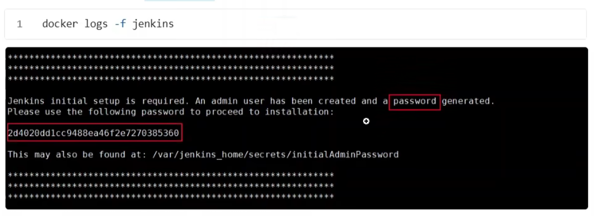

# 🚀 Jenkins Docker Container: Quick Installation & Usage Guide

This guide provides a step-by-step walkthrough to install, run, and manage Jenkins using the official Docker image.

---

## 1. Prerequisites

- [Docker](https://docs.docker.com/get-docker/) installed on your machine (Linux/Mac/Windows)
- Available ports: **8080** (web UI), **50000** (optional, for inbound agents)
- Internet connection for downloading the image

---

## 2. Pull the Jenkins Docker Image

First, pull the official Jenkins LTS image from Docker Hub:

```bash
docker pull jenkins/jenkins:lts
```

3. Start Jenkins in Docker (Recommended)
   To run Jenkins in detached mode with data persistence, execute:

```bash
docker run -d \
--name jenkins \
-p 18080:8080 -p 50000:50000 \
--restart=on-failure \
-v jenkins_home:/var/jenkins_home \
jenkins/jenkins:lts
```
4. Access Jenkins for the First Time
- Open your browser and visit: http://localhost:18080

- To unlock Jenkins, obtain the initial admin password by running:
```bash
docker logs -f jenkins
```
- Copy and paste this password into the setup wizard.
- Follow the on-screen setup (recommended: install suggested plugins).



